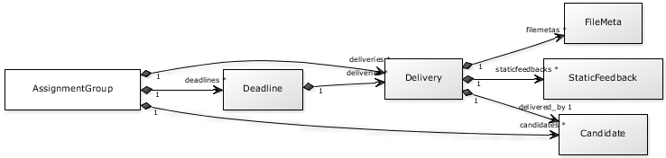

.. _devilry.apps.core.models:

===============================================================
:mod:`devilry.apps.core.models` --- Devilry core datastructure
===============================================================

.. For some reason required to make cross references work.
   http://groups.google.com/group/sphinx-dev/browse_thread/thread/dd921549bc146a5c/2f39d79ce46d447f
.. currentmodule:: devilry.apps.core.models

.. http://yuml.me/diagram/scruffy;dir:LR;scale:80;/class/[Node]++1-subjects >*[Subject], [Node]++0-child-nodes >*[Node], [Subject]++1-periods >*[Period], [Period]++1-assignments >*[Assignment]
.. http://yuml.me/diagram/scruffy;dir:LR;scale:80;/class/[Node]++1-subjects>*[Subject], [Node]++0-child-nodes>*[Node], [Subject]++1-periods>*[Period], [Period]++1-assignments>*[Assignment]
.. http://yuml.me/diagram/scruffy;dir:LR;scale:80;/class/[Assignment]++1-assignmentgroups >*[AssignmentGroup], [AssignmentGroup]++1-deliveries >*[Delivery], [AssignmentGroup]++1-deadlines >*[Deadline], [Delivery]++1-feedback >0..1[Feedback], [Delivery]++1-filemetas >*[FileMeta]

.. image:: images/devilry.core.models.1.png

Functions and attributes
#########################################################

.. automodule:: devilry.apps.core.models
    :members: pathsep, splitpath
    :no-members:

BaseNode
#########################################################

.. autoclass:: devilry.apps.core.models.BaseNode
    :no-members:

AbstractIsAdmin
#########################################################

.. autoclass:: devilry.apps.core.models.AbstractIsAdmin

AbstractIsExaminer
#########################################################

.. autoclass:: devilry.apps.core.models.AbstractIsExaminer

Node
#########################################################

A node at the top of the navigation tree. It is a generic element used to
organize administrators. A Node can be organized below another Node, and it
can only have one parent.

Let us say you use Devilry within two departments at *Fantasy University*;
informatics and mathematics. The university has an administration, and each
department have their own administration. You would end up with this
node-hierarchy:

    - Fantasy University
        - Department of informatics
        - Department of mathematics

.. autoclass:: devilry.apps.core.models.Node

Subject
#########################################################

A subject is a course, seminar, class or something else being given
regularly. A subject is further divided into periods.

.. autoclass:: devilry.apps.core.models.Subject

Period
#########################################################

A Period is a limited period of time, like *spring 2009*, *week 34 2010* or
even a single day.

.. autoclass:: devilry.apps.core.models.Period

Assignment
#########################################################

Represents one assignment within a given Period_ in a given Subject_. Each
assignment contains one AssignmentGroup_ for each student or group of students
permitted to submit deliveries.

.. _assignment-classifications:

We have three main classifications of assignments:

1. A *old assignment* is a assignment where ``Period.end_time`` is in the past.
2. A *published assignment* is a assignment where ``publishing_time`` is in the past.
3. A *active assignment* is a assignment where ``publishing_time`` is in the
   past and current time is before ``Period.end_time``.

.. autoclass:: devilry.apps.core.models.Assignment

Candidate
#########################################################

.. autoclass:: devilry.apps.core.models.Candidate

AssignmentGroup
#########################################################

.. autoclass:: devilry.apps.core.models.AssignmentGroup

Deadline
#########################################################

Each :class:`AssignmentGroup` have zero or more deadlines.

.. autoclass:: devilry.apps.core.models.Deadline

Delivery
#########################################################

You will normally not create Delivery-objects manually, but rather
use :meth:`Delivery.begin`, :meth:`~Delivery.add_file` and
:meth:`~Delivery.finish` like this::

    delivery = Delivery.begin(myassignmentgroup, currentuser)
    delivery.add_file('hello.txt', ['hello', 'world'])
    delivery.add_file('example.py', ['print "hello world"'])
    delivery.finish()

The input to :meth:`add_file` will normally be a file-like object,
but as shown above it can be anything you want.

.. autoclass:: devilry.apps.core.models.Delivery

Feedback
#########################################################

.. autoclass:: devilry.apps.core.models.Feedback

FileMeta
#########################################################

.. autoclass:: devilry.apps.core.models.FileMeta

.. _django.db.models.SlugField: http://docs.djangoproject.com/en/dev/ref/models/fields/#slugfield
.. _django.db.models.CharField: http://docs.djangoproject.com/en/dev/ref/models/fields/#charfield
.. _django.db.models.ForeignKey: http://docs.djangoproject.com/en/dev/ref/models/fields/#foreignkey
.. _django.db.models.ManyToManyField: http://docs.djangoproject.com/en/dev/ref/models/fields/#manytomanyfield
.. _django.db.models.DateTimeField: http://docs.djangoproject.com/en/dev/ref/models/fields/#datetimefield
.. _django.db.models.BooleanField: http://docs.djangoproject.com/en/dev/ref/models/fields/#booleanfield
.. _django.db.models.OneToOneField: http://docs.djangoproject.com/en/dev/ref/models/fields/#onetoonefield
.. _django.db.models.TextField: http://docs.djangoproject.com/en/dev/ref/models/fields/#textfield
.. _django.contrib.auth.models.User: http://docs.djangoproject.com/en/dev/topics/auth/#users
