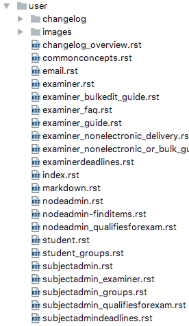

##################################
How to create documentation/guides
##################################

This is a simple guide on how you can write documentation and guides for
users, developers and sysadmins.

.. note::
    Devilry is truly open, not just Open Source, but we also try to keep all
    issues, suggestions and plans in the open. This means that your suggestions,
    bugs, problems, etc. is handled in the open, and readable by anyone.

.. warning::
    **DO NOT post sensitive information** in the documentation/guides.

How do we document the code?
============================

For Devilry we use the Sphinx extension `Napoleon <https://sphinxcontrib-napoleon.readthedocs.io/en/latest/>`
which uses the Google Python Style Guide as documentation syntax. Napoleon is a pre-processor that parses the docstrings
to `reStructucteredText <http://docutils.sourceforge.net/rst.html>` before sphinx parses the documentation.

How to write guides
===================

Let's take the three main documentation/guide categories: user, developer and sysadmin as examples for the `index.rst`
file.

Here's an example of the root `index.rst` file containing a link to the index of the three categories. This is a portion
of the index file taken from the actual Devilry docs::

    ####################################
    Welcome to the Devilry documentation
    ####################################

    Table of contents
    =================

    .. toctree::
        :maxdepth: 1

        user/index
        sysadmin/index
        developer/index
        create_docs_how_to

Let's use the user guide as an example of how you structure the documentation/guides.

The user folder contains it's own `index.rst` file, which again refers to other `.rst` files in the same folder. Here's
an example of the user `index.rst` file looks like::

    ==========================
    Devilry user documentation
    ==========================

    Getting started
    ---------------
    We recommend that you start with a quick look at :ref:`commonconcepts`.
    This avoids confusion with a few special terms that Devilry uses to allow
    it to be used in many different settings. When you have skimmed over the concepts,
    you can continue with the other Topic guides below.

    Common for all roles
    --------------------

    .. toctree::
       :maxdepth: 1

       commonconcepts
       email
       changelog_overview

    Student
    -------

    .. toctree::
       :maxdepth: 1

       student
       student_groups

    Examiner/Corrector
    ------------------

    .. toctree::
       :maxdepth: 1

       examiner

    Subject/Course administrator
    ----------------------------
    .. note::
        For users managing one or more courses.

    .. toctree::
       :maxdepth: 1

       subjectadmin
       subjectadmindeadlines
       subjectadmin_groups
       subjectadmin_examiner
       subjectadmin_qualifiesforexam

    Node/Department admin
    ---------------------
    .. note::
        For users managing a Node containing multiple courses.

    .. toctree::
       :maxdepth: 1

       nodeadmin
       nodeadmin-finditems
       nodeadmin_qualifiesforexam

One can simply add a new `.rst` file, and reference it below one the sections, or create a new section.
Here's an example of the user doc folder:

