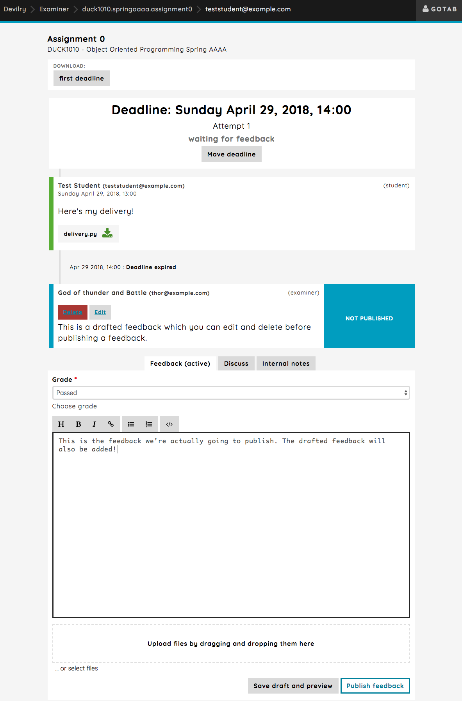

.. _devilry3_examiner_delivery_feed:

==============================
Working with the delivery feed
==============================
Here we'll discuss the topics of how you communicate with the student, correcting assignments,
moving a deadline, giving new attempts and discussing with admins and examiners.

Public discussion in the feed
-----------------------------
When you have the `Discuss` tab active, this simply means that all comments and files uploaded
will be visible to everyone in the group. This is a fine way to answer, ask or discuss something with students, but
will also be seen by admins with access to the group.

.. image:: images/examiner-feed-tab-discuss.png

Internal notes and discussions
------------------------------
When you have the `Internal notes` tab active, this means that everything you write will only be available
for other examiners in the group or admins. Students will not be able to see these comments.

.. image:: images/examiner-feed-tab-internal.png

Correcting an assignment and providing feedback
-----------------------------------------------
Choosing the `Feedback` is where you'll be correcting the assignment and provide feedback for deliveries.
This should also be pretty straight forward, but you also have the option to save a draft of a feedback, meaning
the you can work on a feedback and the result without actually publishing it straight away.

To write a feedback and publish it straight away, simply select the grade from the *Grade* dropdown and
write a feedback in the text input field and press the `Publish feedback` button:

.. image:: images/examiner-feed-feedback-before-post.png

And it will look like this when published:

.. image:: images/examiner-feed-feedback-published.png

Drafting feedbacks before publishing
------------------------------------
You can also write your feedbacks without publishing them straight away. The drafted feedbacks will simply
be shown as comments only you can see, and which you can edit or delete as you like before publishing.

When publishing, all drafted feedbacks will be published with the feedback, which means you can create more than one
drafted feedback.

You simply write something and hit the `Save draft and preview` button:

Here is how it will look like when publishing the feedback (this the direct result from the image above):

.. image:: images/examiner-feed-drafted-feedback-published.png
