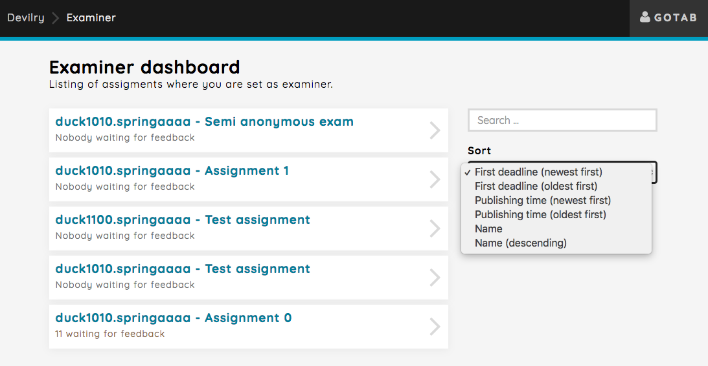

===================================
Getting started guide for examiners
===================================

.. note::

    To avoid confusion when reading this guide, please read
    :ref:`commonconcepts`, at least the :ref:`group_candidate_student` section.

.. note::

    This guide is under construction. Please contact devilry-support@ifi.uio.no
    if you have questions of any kind related to Devilry.

.. _devilry3_examiner_role_overview:

Choose the examiner role
------------------------
After successful login you need to choose *Examiner* from the list of
available roles.

.. image:: images/examiner-roleselect-overview.png

.. _devilry3_examiner_assignment_overview:

Select an assignment
--------------------
After selecting the examiner, you will be taken to the assignment overview. All assignments with groups you are an
examiner on will be listed here, across subjects.

You can easily search for the assignment you are looking for, or order them by:
 - Deadlines (ascending/descending)
 - Assignment publishing time (ascending/descending)
 - Assignment names (ascending/descending)

