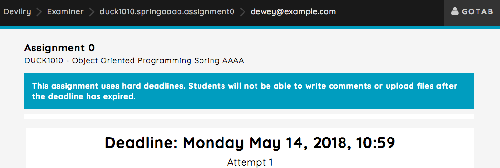

.. _editable_ui_messages:

====================
Editable UI messages
====================

Devilry provides some messages that will appear in the UI with some information that might be useful when a user
navigates pages, such as important information related to a specific setting used that is relevant for the page the user
is currently on.

An example of this will be information regarding hard deadlines as explained below.

***********************************************
Hard deadline information text in delivery feed
***********************************************

At the top of the delivery feed, below the header, a info-box will be visible when hard deadlines are enabled on an
assignment. In this box, important information regarding hard deadlines can be provided to students and users with more
administrative rights, such as examiners and admins.

To add information text supporting a different language code that Devilry also supports, simply add another key
to the dictionary as the ISO 639-1 language code to use (see :ref:`customize_information_text`).

Here are the default settings defined which you can add to your ``devilry_settings.py`` file and edit::

    #: Hard deadline info texts directed towards students.
    #: This is what students see.
    DEVILRY_HARD_DEADLINE_INFO_FOR_STUDENTS = {
       '__default': 'This assignment uses hard deadlines. You will not be able to write comments '
                    'or upload files after the deadline has expired.'
    }

    #: Hard deadline info texts directed towards examiners and admins.
    #: This is what examiners and admins see.
    DEVILRY_HARD_DEADLINE_INFO_FOR_EXAMINERS_AND_ADMINS = {
    '__default': 'This assignment uses hard deadlines. Students will not be able to write comments '
                 'or upload files after the deadline has expired.'
    }

.. note::

    The ``'__default'`` is in english and is marked for translation. You may change this text but do not remove it! The default
    text should also be in a language that all users of the system understands.

How this looks visually for students:

.. image:: images/editable_ui_messages/hard_deadline_info_box_student.png

How this looks visually for examiners and admins:

.. _customize_information_text:

Adding your own information text
================================

We'll take the students as an example, but the setup applies for both ``DEVILRY_HARD_DEADLINE_INFO_FOR_STUDENTS`` and
``DEVILRY_HARD_DEADLINE_INFO_FOR_EXAMINERS_AND_ADMINS``. Let's override the default text and add norwegian
as an option, simply copy and paste the code above to your ``devilry_settings.py`` file and edit it::

    DEVILRY_HARD_DEADLINE_INFO_FOR_STUDENTS = {
       '__default': 'Default text edited.',
       'nb': 'Some information text in norwegian'
    }

The system language will be used to determine which text to use, always defaults to '__default' (so don't remove it!).

