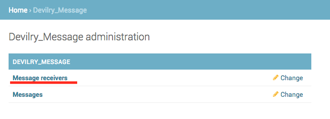
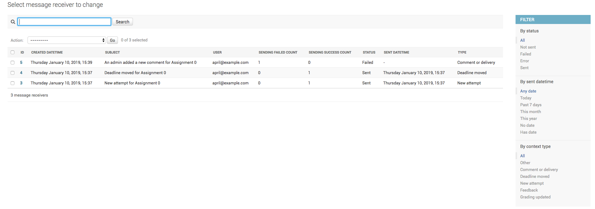
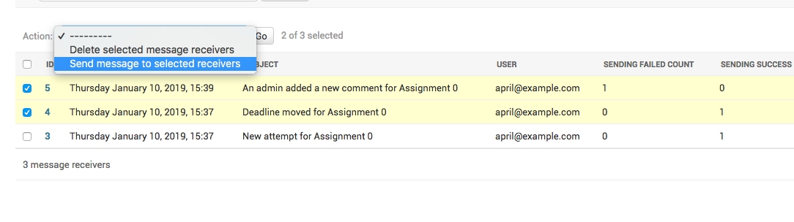
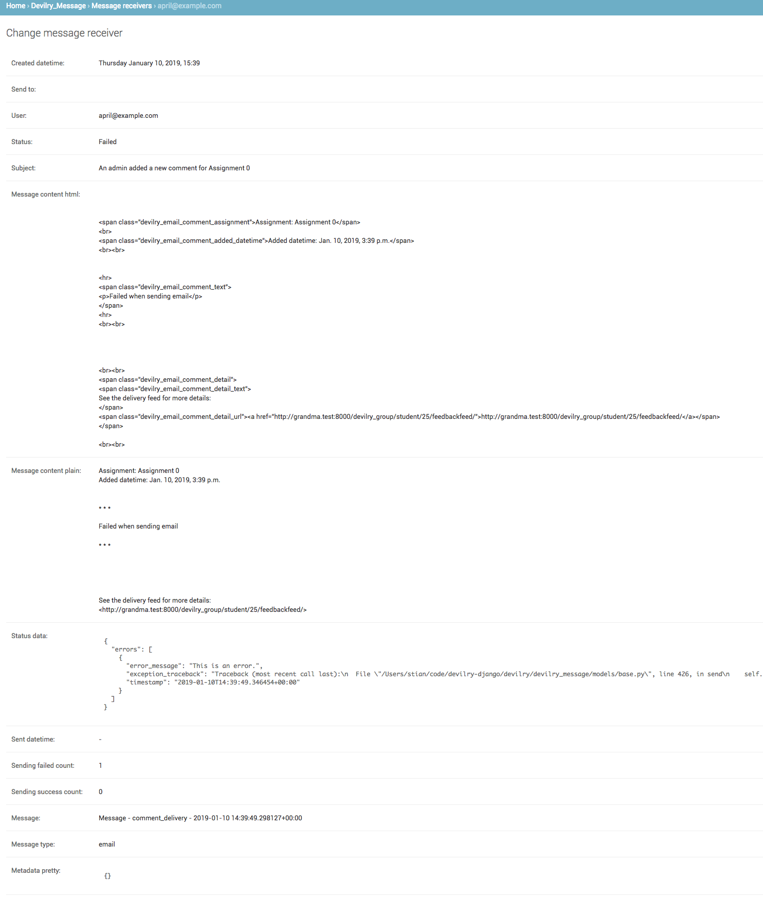

#########################
Devilry message framework
#########################

The message framework stores information about emails sent to users. Information stored consists of the who the message
was sent to, the status of the message, the content both as html and plain text and more meta info. The message content
is stored for each user on their preferred language supported by the Devilry system.

Superusers will have access to each message in the djangoadmin, and can also resend messages if need be.

The status of a message receiver
################################

The status of each message sent to every receiver is stored with the content sent and the current status of the message.

 - Not sent
    The message receiver has been prepared and is ready for sending.

 - Failed
    Tried to send the message to the receiver but an error occurred. The status of a message is set to `Failed` if the
    number of failed attempts is greater than the `DEVILRY_MESSAGE_RESEND_LIMIT` as defined in
    ``~/devilrydeploy/devilry_settings.py``. If the message continue to fail on every resend, the status will be
    automatically be set to `Error` once it exceeds the limit defined by the `DEVILRY_MESSAGE_RESEND_LIMIT`-setting.

    The exception traceback will be stored on the model.

 - Error
    A message has a fail count greater than `DEVILRY_MESSAGE_RESEND_LIMIT`, and should probably looked into.

    The exception traceback will be stored on the model.

 - Sent
    The message was successfully sent (received by the email-server) without any errors being raised.

The reason for having the `Failed` and `Error` status is because the mail-server might stop accepting incoming messages
for a period of time. Messages with the status `Error` will be ignored by the :ref:`devilry_resend_failed_messages`
command.

Configuring the resend limit
############################

You can configure the resend limit with `DEVILRY_MESSAGE_RESEND_LIMIT` in ``~/devilrydeploy/devilry_settings.py``.
For more information, see :ref:`devilry_resend_failed_messages`.

Managing message receivers via Djangoadmin
##########################################

You can see details about messages in Djangoadmin, as well as resend messages.

Where to find the message receivers
***********************************

Log into Djangoadmin, and locate the `Message receivers`-link under `Devilry_Message`.

The message receiver overview
*****************************

The message receiver overview. Here you will see a list of all messages, and some metainfo such as when it was created,
the subject, the receiving user, how many times the message was successfully sent or have failed, status, sent datetime
and the type of message it was.

You can also filter by the status, when it was sent and message type.

Resending message manually
**************************

You can manually resend messages by selecting the receivers you want to send to, then click the dropdown and select
`Send message to selected receivers` and click the `Go`-button. This will try to resend the message regardless of the
status.

Debugging message errors
************************

Once in a while, an error is bound to happen, especially when dealing mail-servers. Each failed message will append
the exception tracebacks, and you will be able to see tracebacks nicely formatted in the detail view of the specific
receiver.

