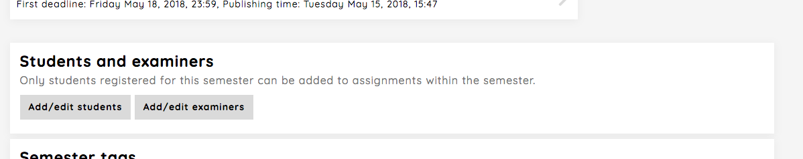
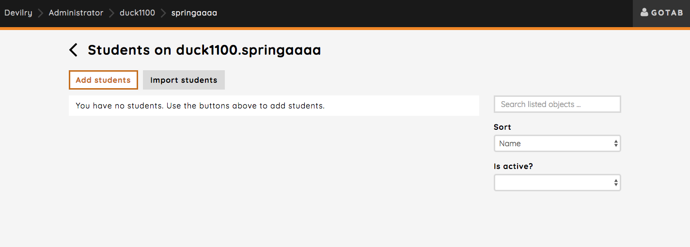
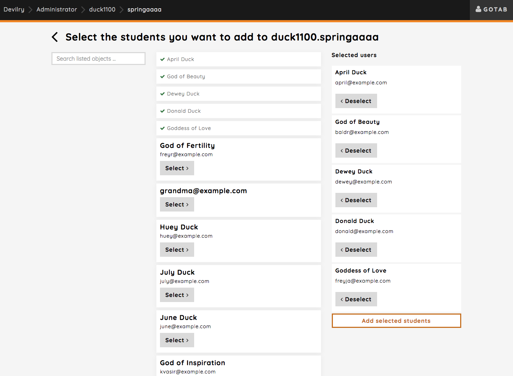
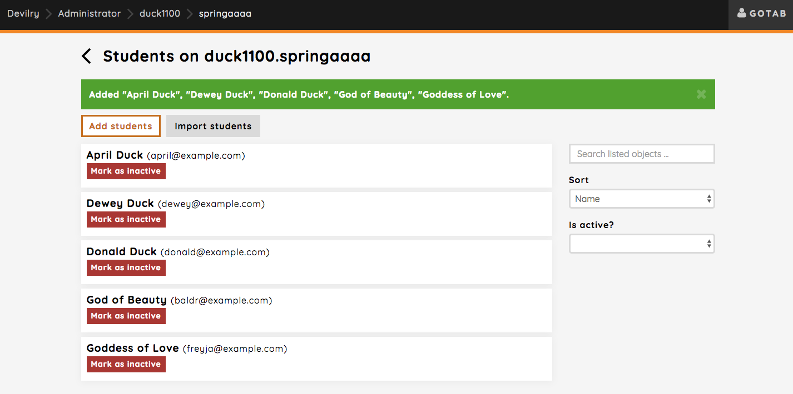
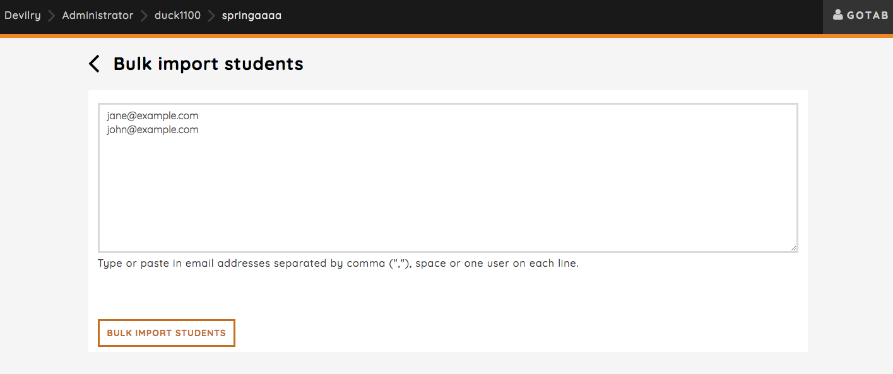

.. _admin_add_students_examiners_to_period:

=============================================
Adding students and examiners to the semester
=============================================
Before you do anything, the first step should always be to add students and examiners to the semester, as students get
automatically added to the assignments you create.

.. note::
    Only examiners added to the semester can be added as examiners for each of the groups in an assignment. Read more
    about that here :ref:`assignment_configuration`

We'll add students to the semester to show the workflow, but the same exact workflow applies to examiners as well.

Clicking the `Add/edit students` from the semester page will take you to an overview of all the students on the
semester. Since we haven't added anyone yet, this overview is empty.

As you can see, there are two options here: `Add students` and `Import students`:

Add students:
    will take you to a page where you can select applicable users in the system. Here you can select multiple users you
    want to add to the semester as students. See :ref:`admin_add_students_from_users`.

Import students:
    makes it possible for you to "import" students from emails by typing the emails in a text input field.
    See :ref:`admin_import_students`

.. _admin_add_students_from_users:

Add students from users
=======================
Let's start by adding students from a list of users. You can add as many or as few as you like, and you also have the
option to search for students by their username or full name.

Clicking the `Add selected students` button will add the users as students on the semester and redirect you back to the
student overview. The students you selected will now be listed here.

.. _admin_import_students:

Import students
===============
You have now added multiple students from existing users in Devilry, but you would like to import some students as well.
Importing students is used when the users does not exist in the Devilry system, and you want to create these users by
their email and add at the same time add them as students. Clicking the `Import students` button will take you to this
page:

You'll see a text input field where you can paste emails of the users you want to import. Explained below the textfield
is the required formats we support: comma-, space- or newline-separated emails::

    jane@example.com,john@example.com

or::

    jane@example.com john@example.com

or::

    jane@example.com
    john@example.com

Clicking the `BULK IMPORT STUDENTS` will create the users and add them as students on the semester.

.. note::
    Only users with emails that does not already exist in the system will be added.
