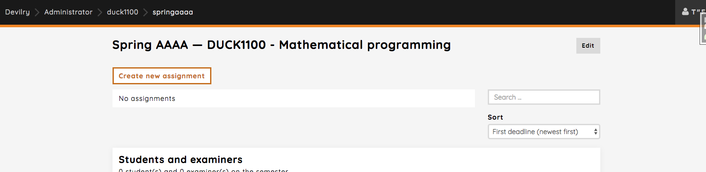
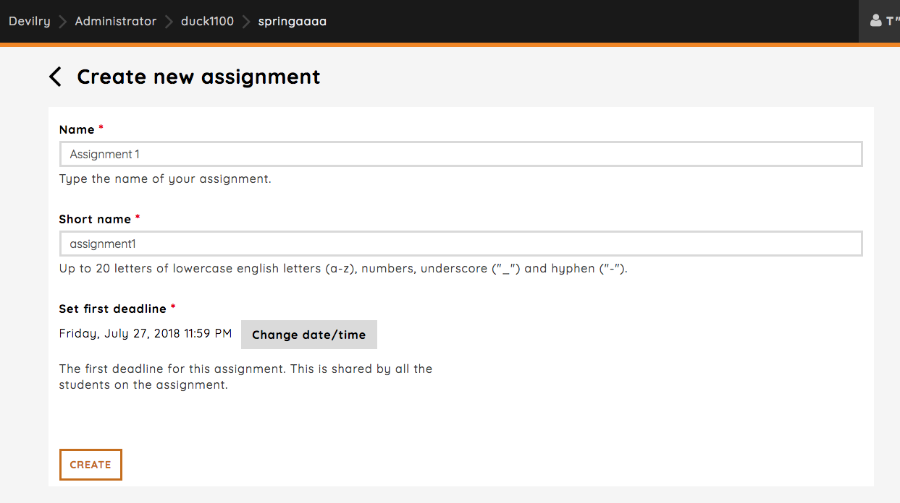

.. _admin_create_assignment:

============================================
Creating a new assignment (WORK IN PROGRESS)
============================================
We'll take you through the workflow of creating a new assignment, setting the first deadline, adding students and
examiners, editing and configuration of the assignment.

Creating a new assignment
#########################
Creating a new assignment is a pretty simple process. Clicking the `Create new assignment`-link will take you to the
page where you actually create the assignment.

The create assignment page has a few required fields that's needs to be set before you can create the assignment. Simply
give the assignment a name and a first deadline. You have a lot of options for tweaking the assignment after it has
been created. We'll create a simple assignment called `Assignment 1` with deadline set to July 27, 2018 11:59 pm.

