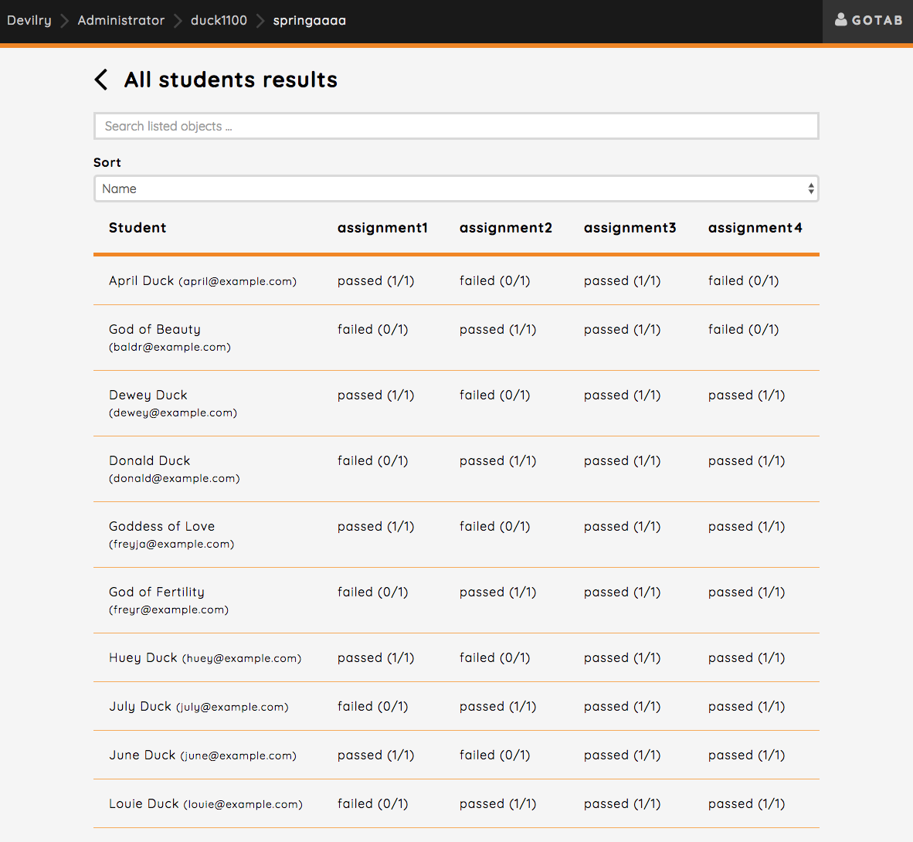
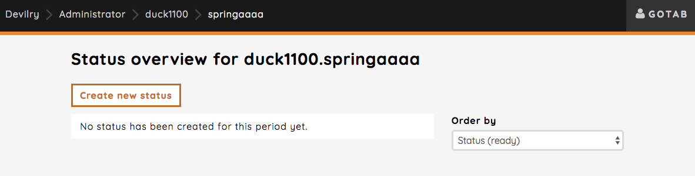
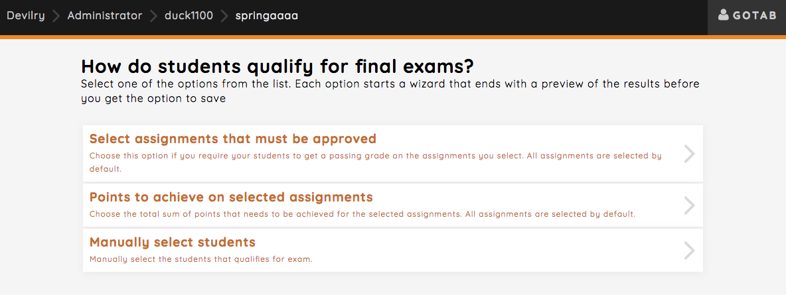
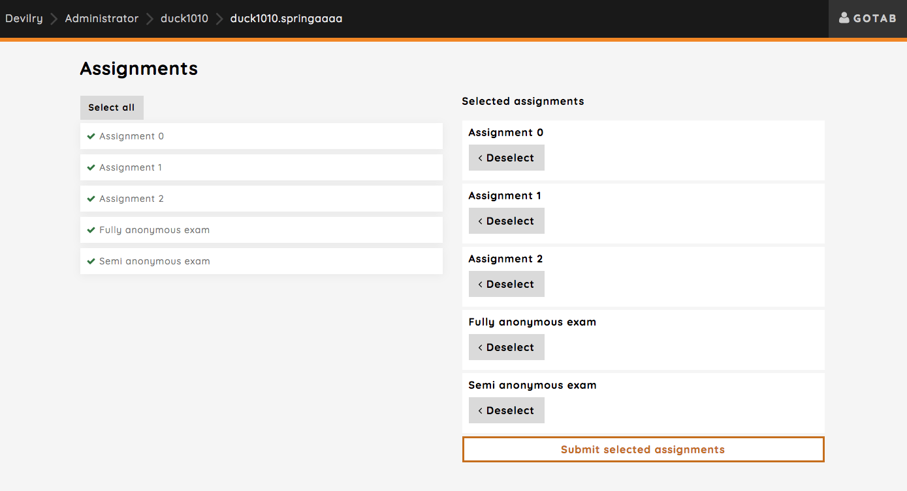
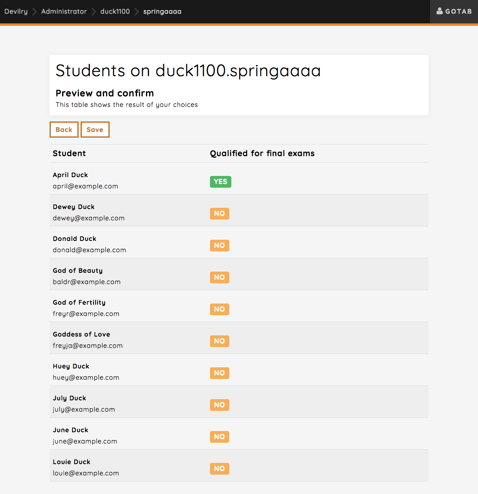
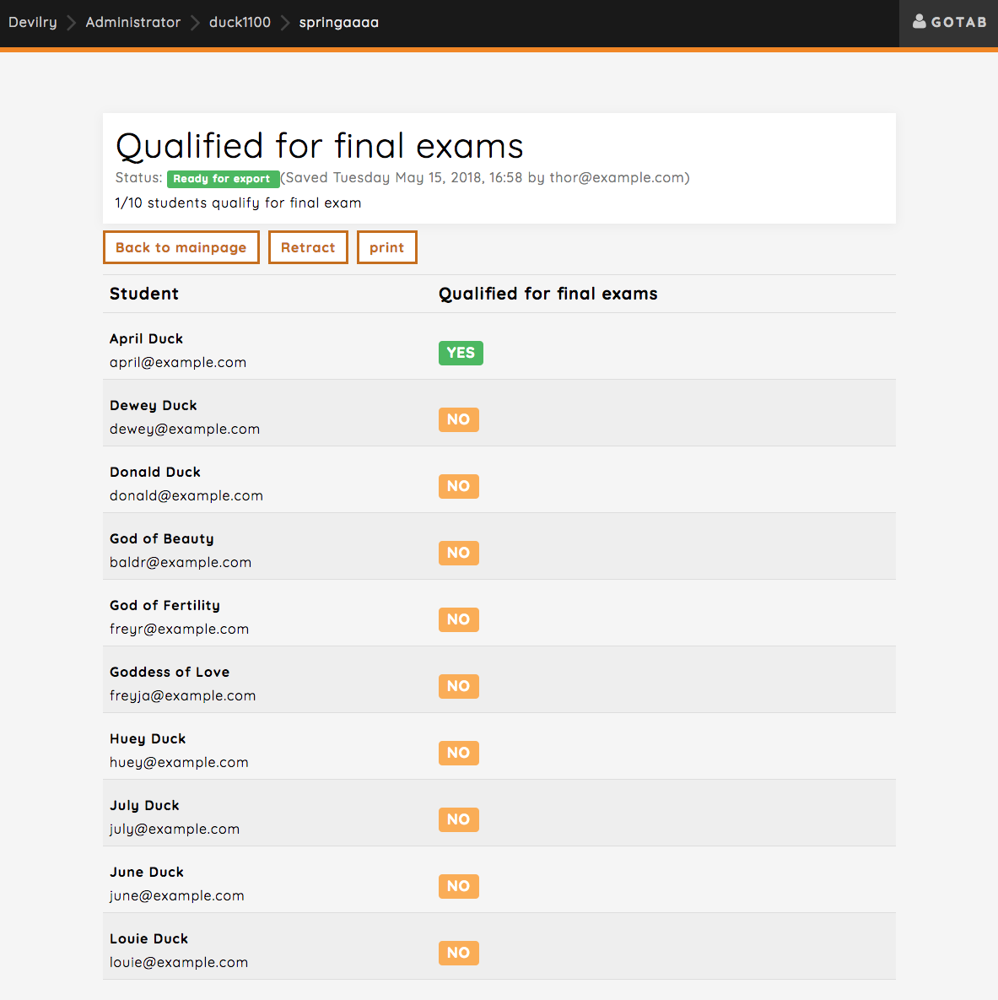
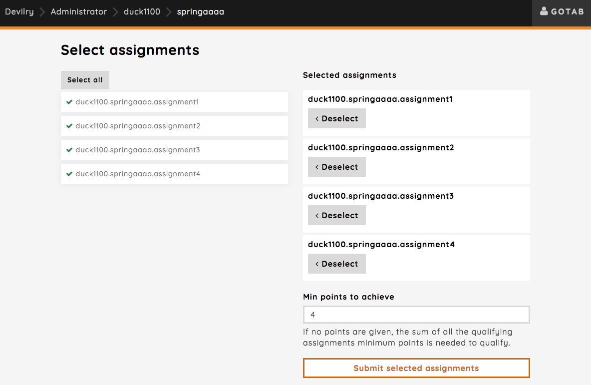
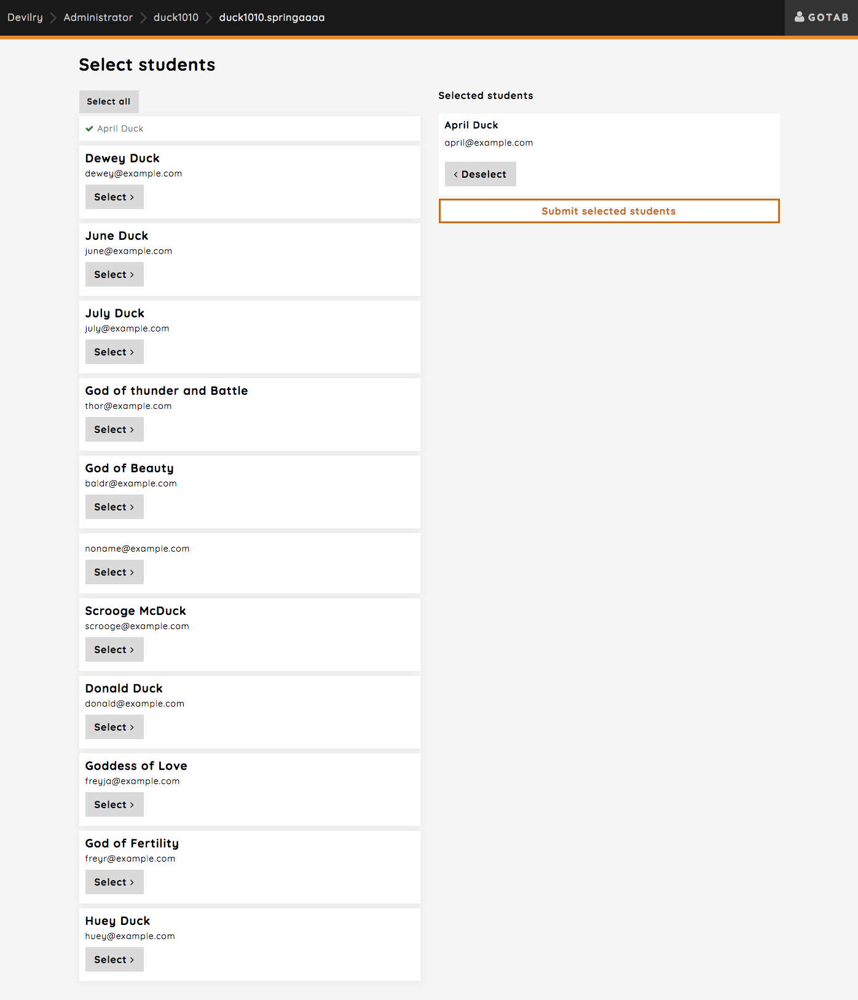
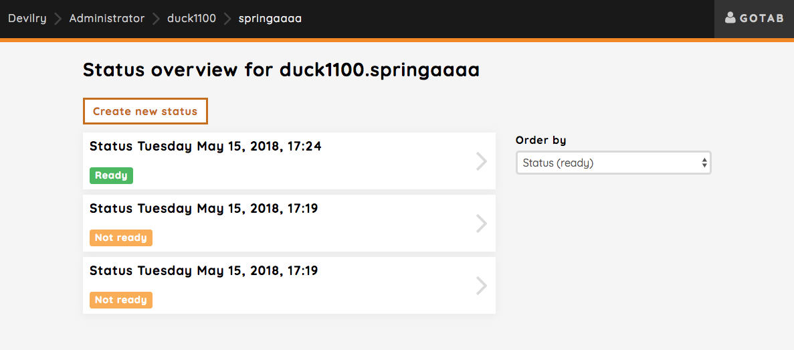

.. _admin_result_utilities:

=======================================
Result and qualifies for exam utilities
=======================================
Devilry provides a couple of additional utilities regarding the overall results for the students on the semester and
qualifying students for final exams.

Overview of all results
=======================
The overview shows a table with an entry for each student and their result/status on each assignment. You can also
download an Excel-report of the current results as seen in the table.

Qualifies for final exam
========================
You can create exam lists based on the current results of students, whether they should be able to take the final exam
or not. You can choose how you want to qualify students for the exam either by selecting the assignments that has to be
passed, a total number of points to achieve across selected assignments or you can just manually select students that
qualify.

Clicking the `Create new status` button will take you to a page where you can select how you want qualify students for
the final exam.

You have three methods you can use to qualify students for the final exam as mentioned above.

Select assignments:
    Select the assignments that the student must pass. See :ref:`admin_qualifies_for_exam_method_select_assignments`

Points to achieve on selected assignments:
    Define a total score the student must have accumulated across assignments you select.
    See :ref:`admin_qualifies_for_exam_method_points`

Manually select students:
    Select which students that should qualify without any requirements.
    See :ref:`admin_qualifies_for_exam_method_select_students`

.. _admin_qualifies_for_exam_method_select_assignments:

Select assignments
==================
Let's start with selecting the assignments that must be approved. Clicking this method will take you to a page where
all assignments are selected by default. You can remove any assignment, but at least one must be selected.

.. _admin_qualifies_for_exam_result_preview:

Preview and created status
**************************

Clicking the `Submit selected assignments` button will take you to the next step which is a preview of all students and
their current status of whether or not they qualify for final exam.

Clicking the save button will generate a status for the students much like the preview view, which can be printed or
retracted. Retracting the qualification status means that you can still view it, but it's not considered up to date
anymore, and you have to create a new one. It will still be listed in the qualification status overview, but will be
marked as "Not ready".

.. _admin_qualifies_for_exam_method_points:

Points to achieve on selected assignments
=========================================
You define a minimum number of points that the students has to achieve on all selected assignments. The score for each
student is then calculated for the selected assignments, and their total score has be the same or higher that what you
defined. You need to keep control of what the minimum score is for each assignment to correctly define what the minimum
score is (information about this will be added later).

If you do not define minimum points to achieve, the minimum points from the assignment will be used.

After clicking the `Submit selected assignments` button you will be taken to the preview step,
see :ref:`admin_qualifies_for_exam_result_preview`.

.. _admin_qualifies_for_exam_method_select_students:

Manually select students
========================
You can also just select students you want to qualify for final exams manually. Assignment results are not take into
consideration here.

After clicking the `Submit selected students` button you will be taken to the preview step,
see :ref:`admin_qualifies_for_exam_result_preview`.

The final qualification status overview
=======================================
You can see all the statuses created here, but you can only ever have one with the status "Ready". This is the final
result, the actual list of students that qualify for final exams. You always have the option to retract a status, and
create a new one.

