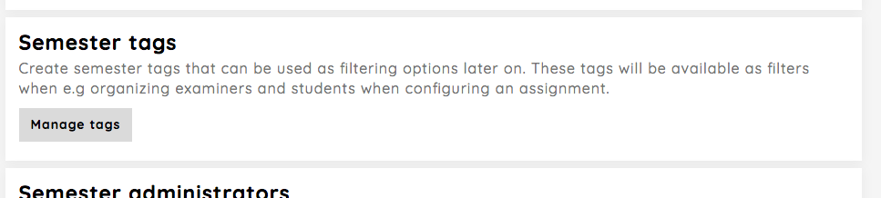
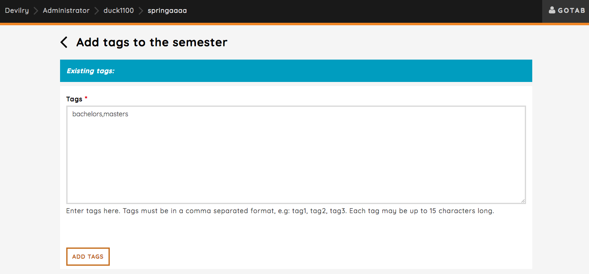
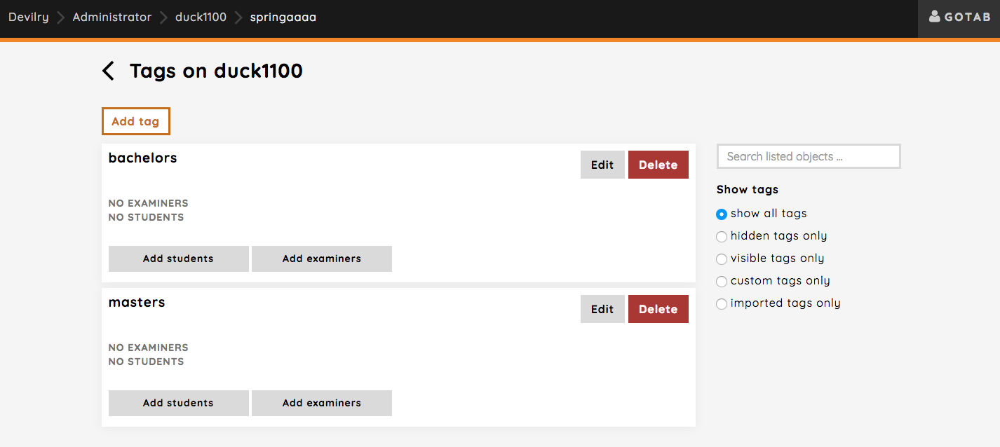
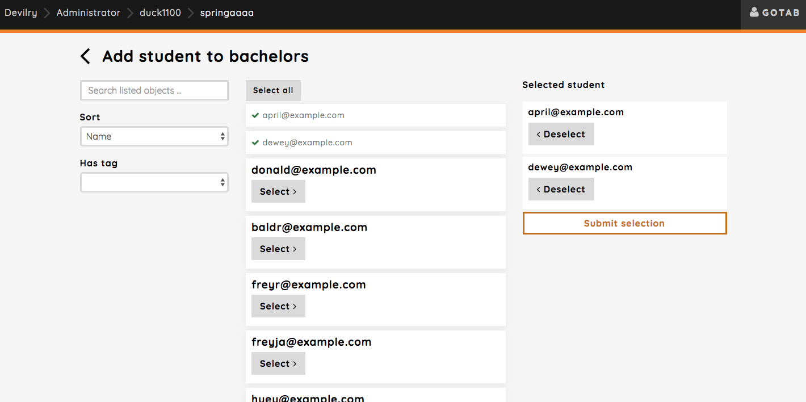
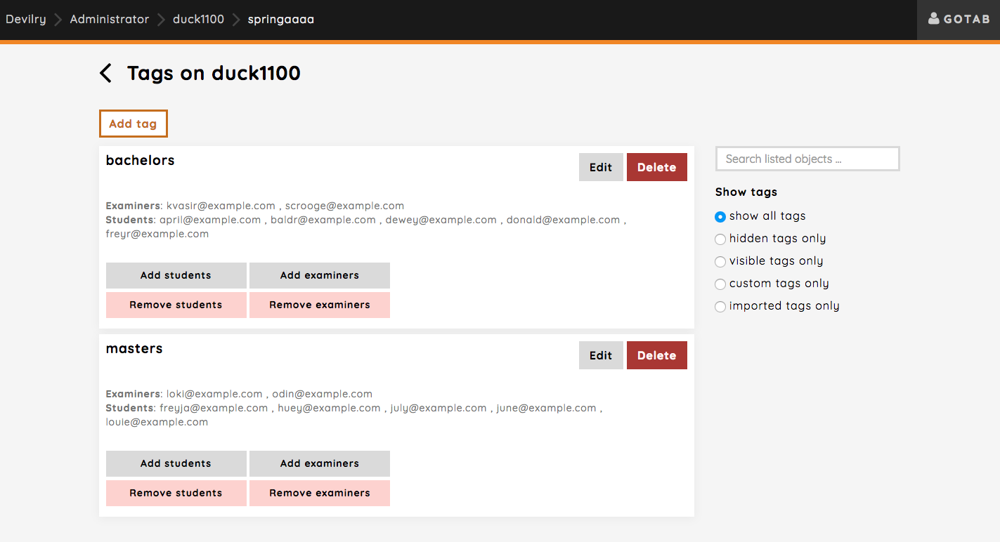

.. _admin_semester_tags:

===========================
Creating tags on a semester
===========================
Semester tags makes it possible to filter and organize students and examiners together. Added tags
will show up as an extra feature in filters, and can be used to organize students and examiners
when setting up an assignment.

Clicking the `Manage tags` button will redirect you to the page for managing tags on the semester.

There are two kinds of tags. The ones you(or some other admin) has created, and imported tags.

Imported tags:
    These are tags imported from some external service meant for use in Devilry and can not be edited. This something
    handled by sysadmins when creating new courses. You can hide these tags, which means that they won't be visible in
    filters.

Tags you create:
    You can create, edit or delete tags yourself. You can add multiple students and examiners to each tag, and each
    student and examiner can be added to multiple tags.

What is a typical use case for tags?
===================================
A typical use case would be for courses for both bachelors and masters students. The course has two sets of assignments,
one for bachelors and one for masters. You can create a "bachelors" tag, and a "masters" tag and assign students and
examiners to them. You can then filter by these tags when configuring an assignment later on. MISSING LINK!

Let's go through the steps where we create a "bachelors" tag and a "masters" tag. Clicking the `Add tag` button on the
semester tag overview page will take you to the page for creating tags.

You can add a single tag, or multiple tags in a comma separated format. Clicking the `ADD TAGS` button will create the
tags and redirect you to the semester tag overview.

The created tags are now listed, and you have the option to add students and examiners to them. Let's add some students
to the tags by clicking the `Add students` button.

It's the exact same workflow for adding examiners as well. The complete result looks like this:

Later on, when configuring the assignment, these tags will be available and students and examiners can be filtered by
these tags.