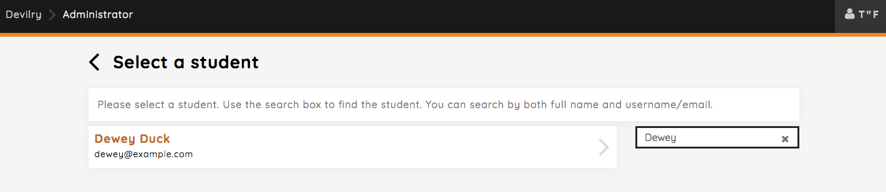
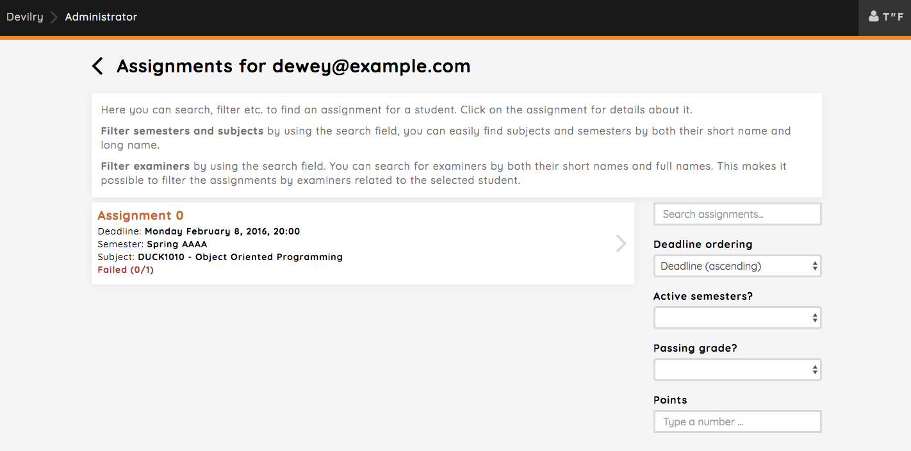
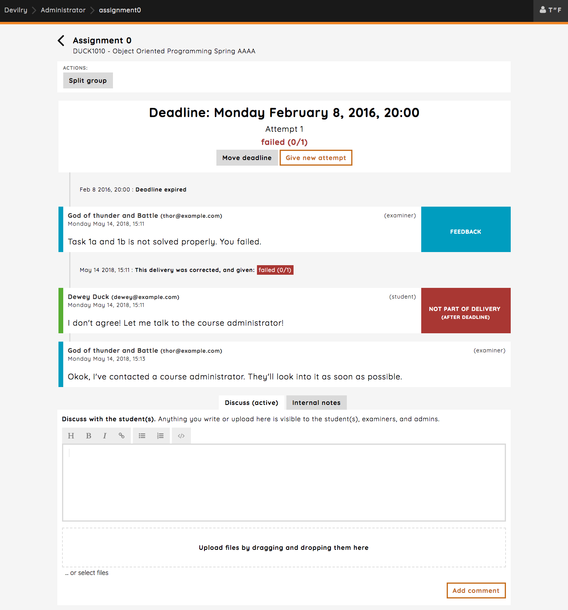

.. _admin_wizard_find_student:

=====================================
Quickly navigating to a delivery feed
=====================================
Finding the delivery feed of a specific student should always be easy and accessible. On the admin frontpage, you
have the `Find a student` option available to you. This is a "step-by-step" wizard for locating delivery information
about a particular student.

Here's a simple example: Dewey is not pleased with the feedback, and wants to involve an administrator to sort things
out.

Clicking the `Find a student` button, which will take you to a page with a list of students you have access to.
You can search for students by name here.

Clicking on Dewey will take you to Deweys assignment group overview. Here all of Deweys assignments will be listed,
with some meta information and so on. Note that all of Deweys assignments will show up here, but in this
case Dewey only has one.

Clicking on one of the assignments in the list will take you to Deweys delivery feed for that particular assignment.

