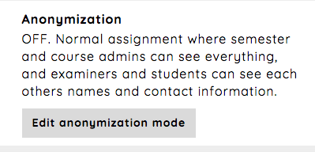

.. _admin_anonymization_assignment:

=============
Anonymization
=============

When an assignment is created the anonymization mode is sat to off. This means that course and semester administrators
can see everything regarding the assignment. Further can students and examiners see each others names and contact
information.

The other anonymization mode `Semi anonymous` has the following configuration:

 - Students and examiners cannot see each others information
 - Semester administrators cannot access the assignment from the admin UI
 - Course administrators can see everything

If you want to configure the default configuration, follow the `Edit anonymization mode`-link from the assignment's
dashboard.

