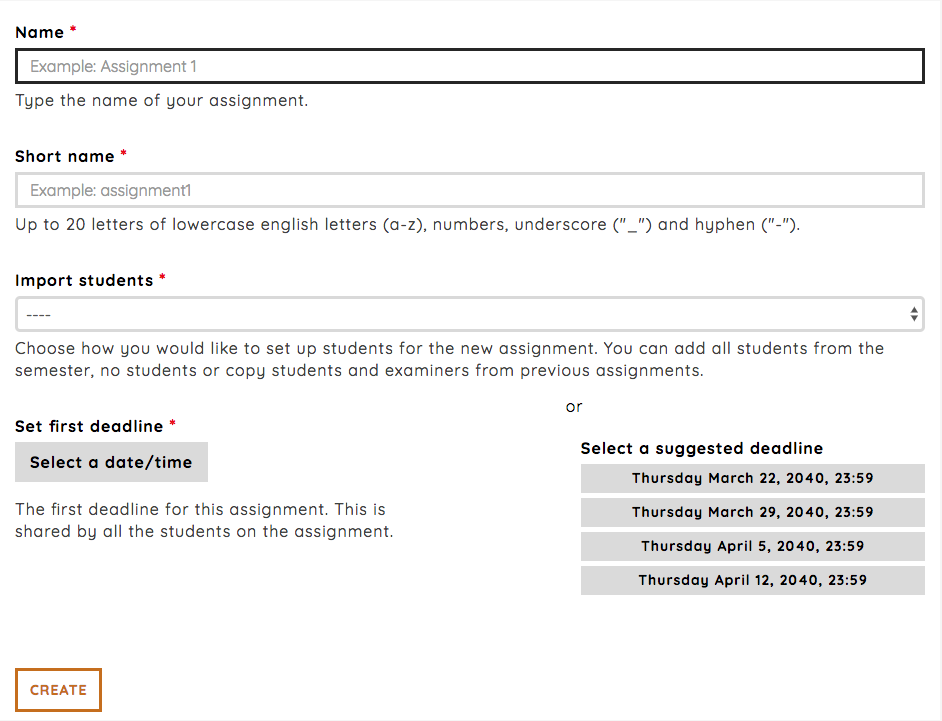

.. _admin_create_assignment:

============================================
Creating a new assignment (WORK IN PROGRESS)
============================================
We'll take you through the workflow of creating a new assignment, setting the first deadline, adding students and
examiners, editing and configuration of the assignment.

Creating a new assignment
#########################
Creating a new assignment is a pretty simple process. Clicking the `Create new assignment`-link will take you to the
page where you actually create the assignment.

.. image:: images/admin-create-assignment-link.png

The create assignment page has a few required fields that's needs to be set before you can create the assignment. Simply
give the assignment a name and a first deadline. You have a lot of options for tweaking the assignment after it has
been created. We'll create a simple assignment called `Assignment 33` with deadline set to November 21, 2018 11:40 am
by using the `Select a date/time`. You can also use one of the suggested deadlines.

.. _defaults_new_assignment:

Defaults for a new assignment
#############################
The following are configured as a default:
 - All active students in the course in the semester are added to the assignment
 - All students added to the semester are organized in a project group
 - No examiners are connected with a student or group
 - The new assignment will be published 6 hours after creation
 - Grading is passed or failed
 - Anonymization is off
 - Deadline handling is soft

You can read more about each of the configurations here:

.. toctree::
   :maxdepth: 1

   admin_manage_students_assignment
   admin_manage_examiners_assignment
   admin_manage_publish_deadline_assignment
   admin_grading_configuration_assignment
   admin_project_group_settings_assignment
   admin_anonymization_assignment
   admin_deadline_handling_assignment
