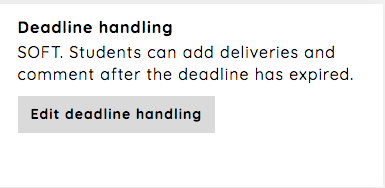

.. _deadline_handling_assignment:

=================
Deadline handling
=================
There are two types of deadline handling for an assignment, `Soft` and `Hard`. New assignments have soft as a default.

To change the deadline handling for an assignment, follow the `Edit deadline handling`-link from the assignment
dashboard.

Soft deadline
#############
Students can upload deliveries and add comments after deadline expiration. Deliveries made after the deadline will be
clearly highlighted and examiners might not take these deliveries into consideration when correcting deliveries.

Hard deadline
#############
Student cannot upload or comment after deadline expiration.

