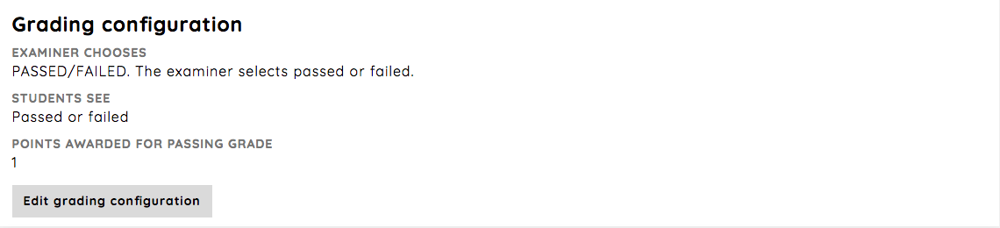
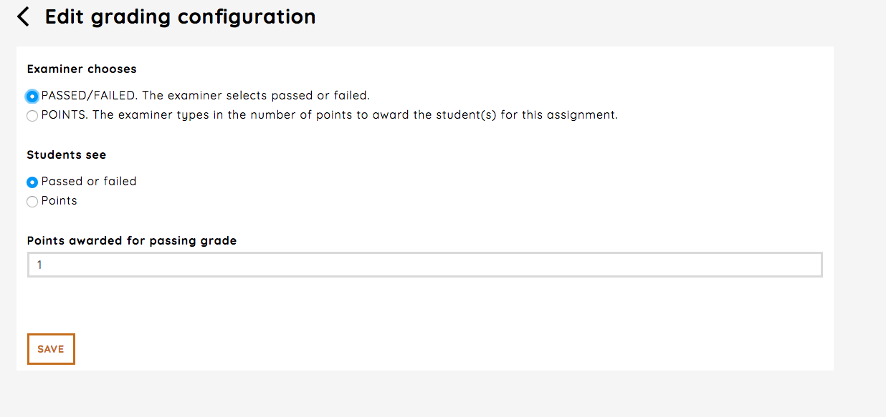
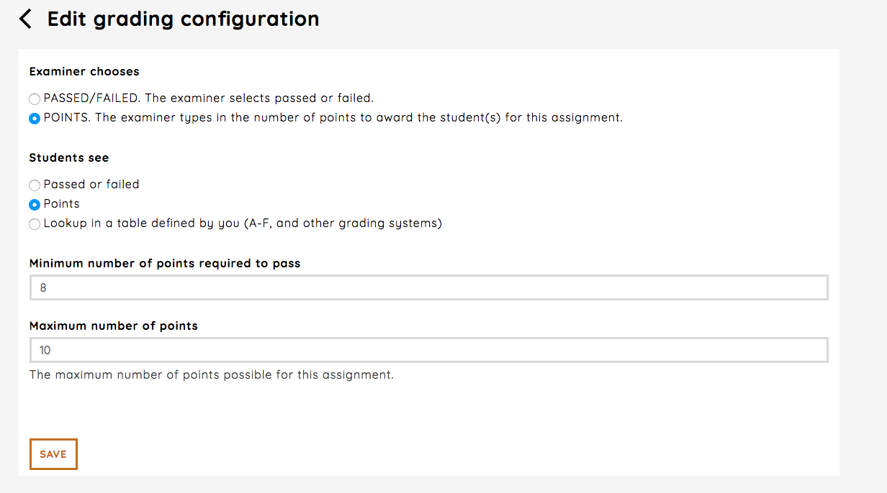

.. _grading_configuration_assignment:

=====================
Grading configuration
=====================

To change the default grading configuration for an assignment, click the `Edit grading configuration`-link.

On this view you set how the examiner grades deliveries from a student for an assignment. There are two options:

 - Passed/Failed
 - Points

Further you also decide how the student sees the grading; passed/failed or with the number of points.

.. _passed_failed_grading_assignment:

Passed/Failed
#############
If this option is chosen, you can also give students points awarded for getting a passing grad. This may be useful if
you have 10 assignments in a semester and students need 8 point to qualify for the exam. The assignments in a semester
may reward different points, so a bigger assignment may give 2 points.

.. _points_grading_assignment:

Points
######
When choosing points as grading for an assignment, you can either use numbers or a table defined by you.

Numbers
-------
If you chose numbers you have to set the minimum number of points to pass and the maximum number of for the assignment.

Table
-----
You can define your own table, or use the A-F configuration provided by Devilry. In the example below, the A-F
configuration is used.

.. image:: images/admin-grading-configuration-points-table-page.png
