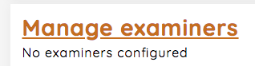
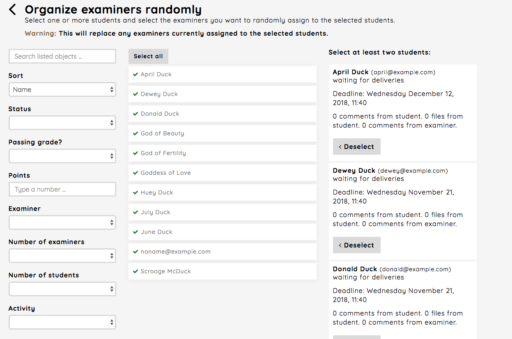
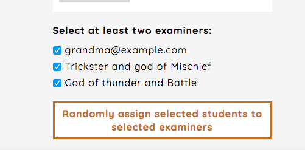
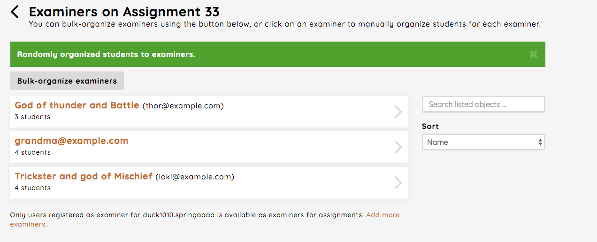
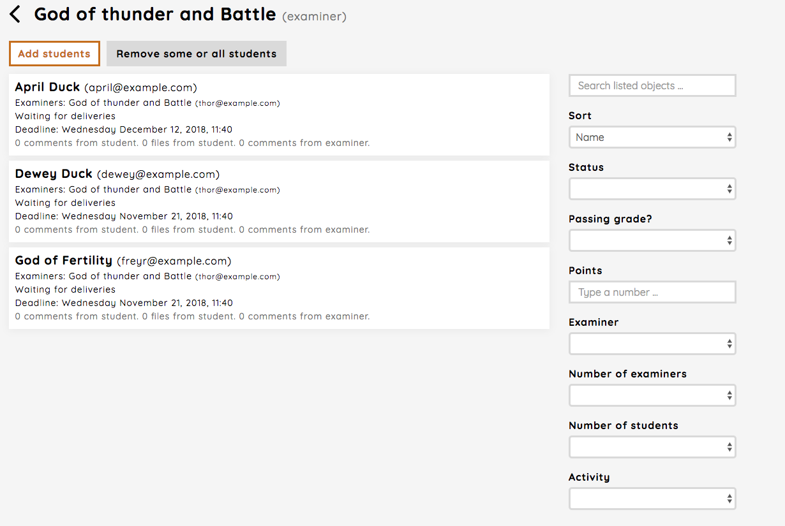

.. _admin_manage_examiners_assignment:

================
Manage examiners
================
If you need information about the examiner role read the :ref:`role_examiner`.

If you need information aobut how to add examiners to a course, read the :ref:`admin_add_students_examiners_to_period`

The menu item `Manage examiners` starts with two warnings when creating a new assignment. This is as it should be, since
no examiners are yet connected with any students, nor are any examiners configured. To start this process, click
the `Manage examiners`-link (or the `Configure examiners`-link in one of the warnings).

There are two major ways configure examiners for an assignment

 - You randomize it all
 - You manually control it all

Important
#########
One student can be assigned to one or many examiners. One use case where this is useful is when one examiner needs to
get a second opinion from another examiner.

.. _bulk_organize_examiners_assignment:

Bulk organize examiners
#######################
If you chose the `Bulk-organize examiners`-link on the examiners page, you will have the options of organize examiners
randomly or manually. Here you can also replace examiners.

Both randomly and manually have the same structure. You chose students and than you chose examiners. In this example,
we will show how to configure examiners with the random option.

First the `Organize examiners randomly`-link is chosen.

Next we chose all the students and than chose the examiners we want to use, before finally clicking the button. You
can also use the filter options when assigning students to examiners.

When the program is done assigning students to examiners, you'll be taken back to the dashboard. You can now see how
many students which are connected to each examiner.

.. _single_examiner_assignment:

Single examiner
###############
You can also handle a single examiner by clicking the block element of the examiner in the dashboard. Here you can
add or remove students for the chosen examiner.

The `Add students`-link takes you to a view which works just like the one described in
:ref:`bulk_organize_examiners_assignment`, but without the random option. You chose one or more students and assign
them to the examiner. And there are several filter options which you can use, for instance if you want an examiner
to only handle students with a status of waiting for feedback or students which have not received any comments yet. The
latter is found under the `Activity` filter.

When it comes to the `Remove some or all students`-link, this also works after the same principles as described in
:ref:`bulk_organize_examiners_assignment`. You chose which students to remove and then click the execute button.

