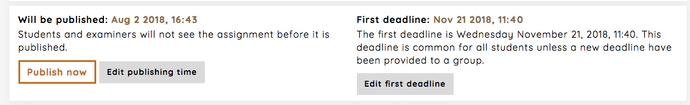

.. _manage_publish_deadline_assignment:

===================================
Manage publishing time and deadline
===================================
In the dashboard for an assignment you can see and edit the publish time and the deadline time. When creating a new
assignment the publish time is by default 6 hours from the time of creation. On the dashboard you can chose to publish
an assignment now, or set the time to be sometime in the future.

From the dashboard you can also manage the general deadline for the assignment. When setting this if affects all groups
unless you have given a group another deadline as described in :ref:`manage_deadline_assignment`

