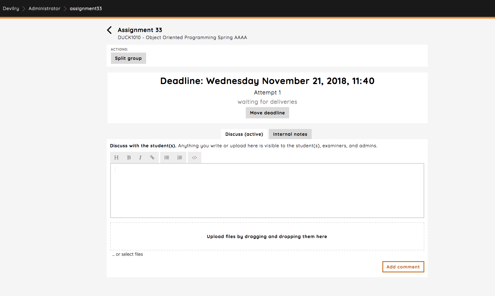
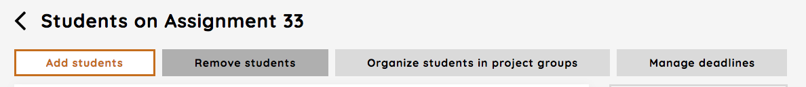
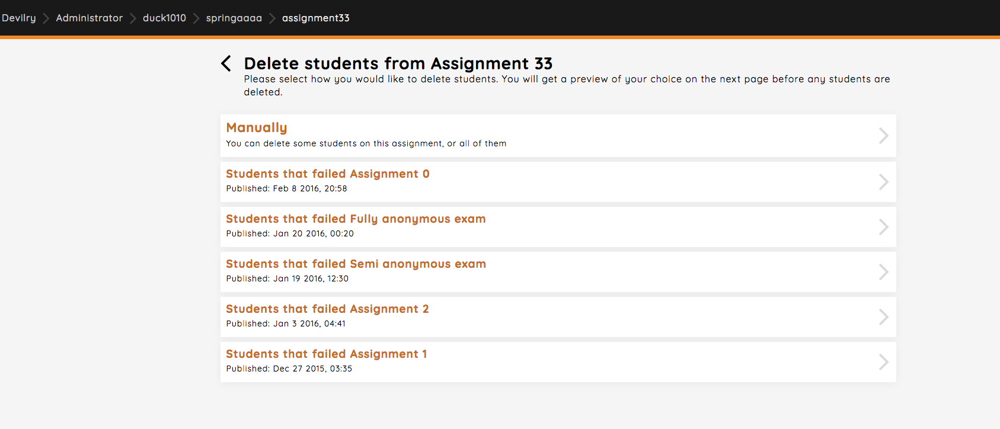
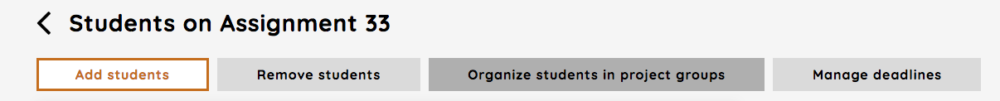
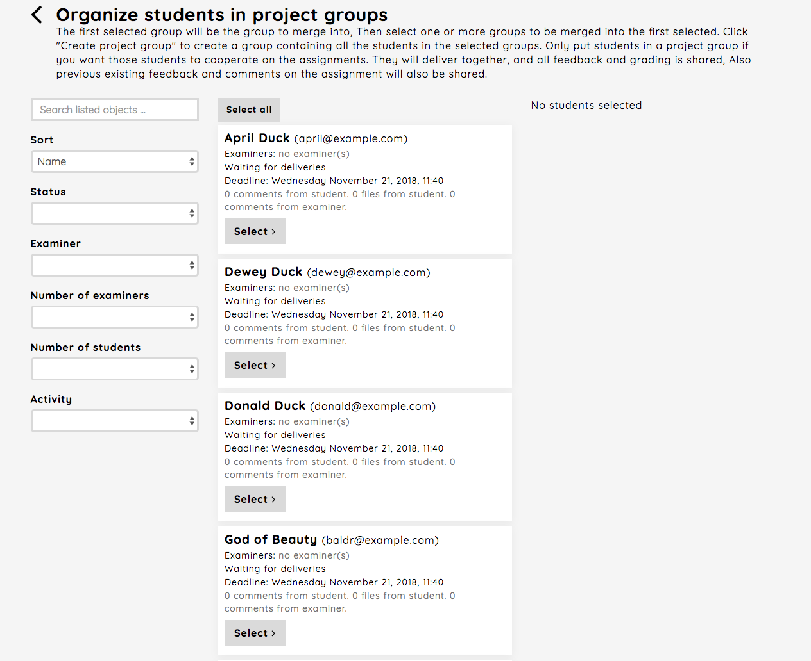
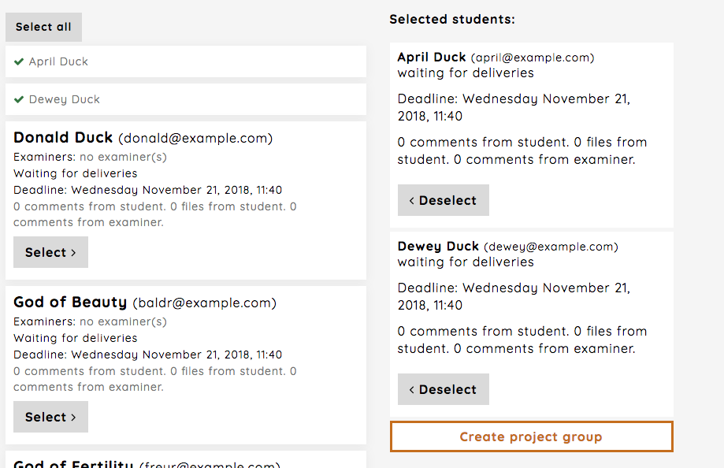
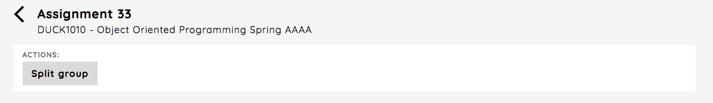
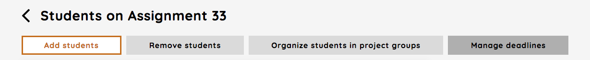
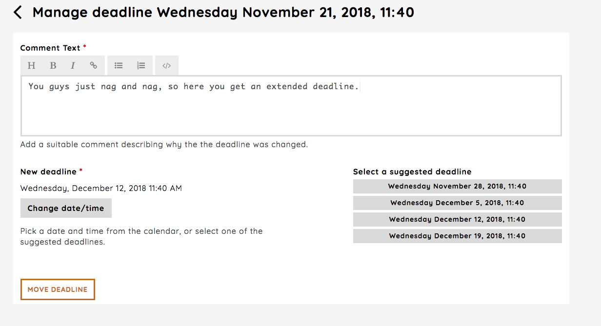

.. _manage_students_assignment:

===========================
Manage students assignment
===========================
You manage students in an assignment by clicking the `Manage students`-link.

.. image:: images/admin-manage-students-link.png

Here you can add or remove students, organize project groups, manage deadlines and see student information regarding
the assignment.

.. image:: images/admin-manage-students-page.png

.. _student_information_assignment:

Student information
###################
By clicking the block element of a student, you get information about the current status of deliveries for that
student for the assignment. When working with an unpublished assignment, there is off course no information here.

.. _add_students_assignment:

Add students
############
By following the `Add students`-link you can:

 - add all students from the course (automatically done when creating a new assignment for active students)
 - add students from other assignments in the course, either all or those which have passed the assignment
 - add students which have completed an exam for the course, either all or those which have passed the exam

.. image:: images/admin-add-students-page.png

.. _remove_students_groups_assignment:

Remove students
#################################
By following the `Remove students`-link you can remove students from the assignment.

You have different options regarding which student(s) to remove from an assignment. You can chose those which did not
pass another assignment or exam, or remove students manually.

.. _organize_project_groups_assignment:

Organize students in project groups
###################################
The `Organize students in project groups`-link gives you the opportunity to change the default organization of
project groups.

As mentioned in :ref:`defaults_new_assignment` a student is automatically put in a project group when a new assignment
is created. If you want to have larger project groups for the assignment, you can do this on this page.

As an example we here want to have two students in a project group. We start with selecting April Duck and Dewey Duck
in one project group, and than click the `Create project group` button.

If you now go back to the `Manage students` page (back button two times after creating the new group) you'll see there
is a new group with two members. If you now want to undo this action, splitting the group back to two groups with a
single student in each, you click the block element of the group as described in :ref:`student_information_assignment`.
Here you chose the `Split group`-link.

In the next view you chose which student(s) to remove from the group.

.. _manage_deadline_assignment:

Manage deadline
###############
The last meny option in this section is the `Manage deadline`-link.

Here you have the possibility for change the deadline for delivery for all groups or for just some groups. After
choosing which groups that should get an extended deadline, you have to add a comment which says why the chosen groups
get the extension and set the new deadline. When you're good to go, click `Move deadline`.

