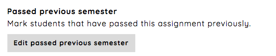

.. _passed_previous_semester_assignment:

========================
Passed previous semester
========================
When you have students which have taken the course earlier and have passed the assignment, you can mark them as
`passed previous semester` by following the `Edit passed previous semester`-link from the assignment's dashboard.

Mark students as passed previous semester
#########################################
You can manually mark students as passed or do this automatically. The latter solution requires that the assignment
has the same short name as the previous assignment. Make your chose and follow the instructions.

.. image:: images/admin-passed-previous-semester-page.png
