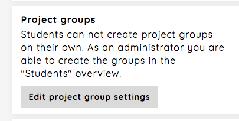
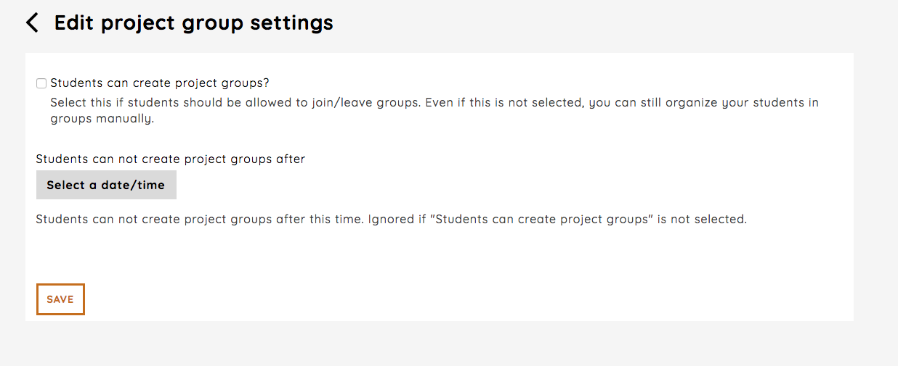

.. _project_group_settings_assignment:

======================
Project group settings
======================
To change the settings for project groups for an assignment, you follow the `Edit project group settings`-link from
the assignment dashboard.

Students can create project groups
##################################
By default only users with administrator rights may create project groups for an assignment. However, this may be too
much work for courses with many students. Therefor you can allow students to create project groups for an assignment.
Further you can set a date for which after students cannot create groups. Remember that allowing students to create
project groups also means students may leave a project group.

