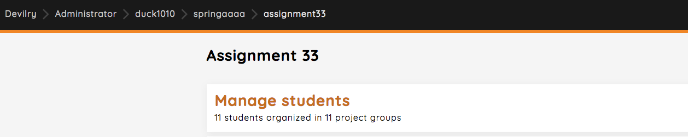
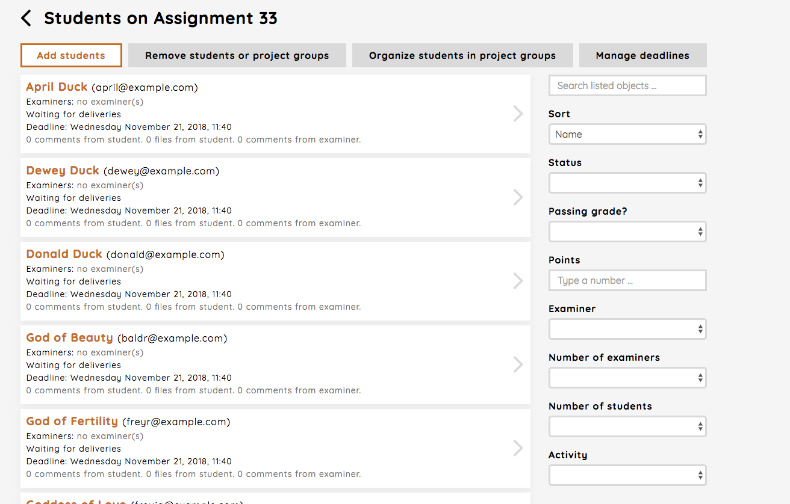
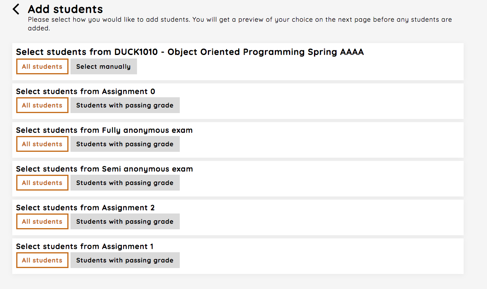

.. _students_new_assignment:

=======================
Students new assignment
=======================
You manage students in an assignment by clicking the `Manage students`-link.

Here you can add students, remove students or project groups, organize project groups and manage deadlines.

.. _add_students_assignment:

Add students
############

By following the `Add students`-link you can:

 - add all students from the course (automatically done when creating a new assignment for active students)
 - add students from other assignments in the course, either all or those which have passed the assignment
 - add students which have completed an exam for the course, either all or those which have passed the exam

