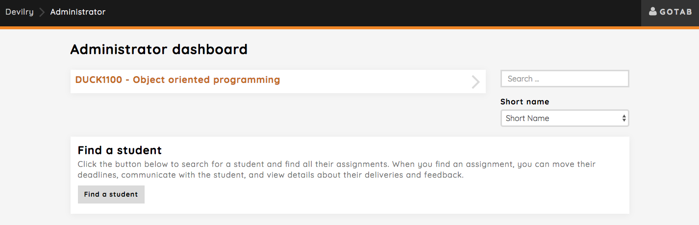
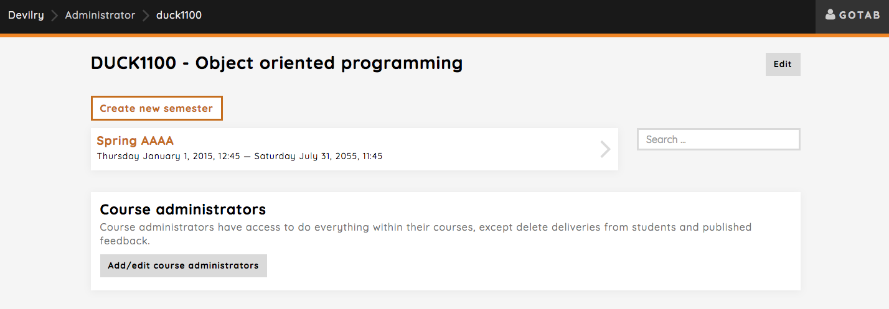
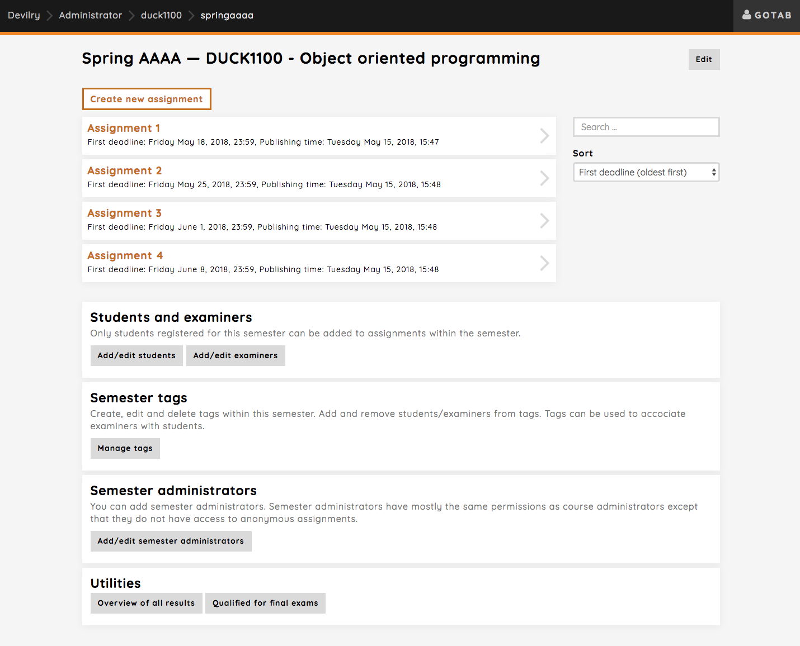

.. _user_role_subjectadmin:

=====================================
Introduction to the Subjectadmin role
=====================================

.. note:: Please read, or at least take a quick look at, the :ref:`user_commonconcepts` before reading this guide.

Who this guide is for
#####################
A subject is, as explained in the common concepts guide, typically a course.
This means that this guide is for administrators managing a course or a term
(semester) within a course. If you have *orange* background color in your
header, you are using the user interface for an admin role.
We'll use the term *course* for a subject from now on

The responsibilities of a Subjectadmin
######################################
A Subjectadmin manage one or more :ref:`user_subject`, and/or :ref:`user_period`. They set up
assignments, organize students into :ref:`user_group_candidate_student`, and
assignment :ref:`user_examiner` to give feedback to students.

Commmon tasks
#############

.. _findsubjectadminfrontpage:

The Subjectadmin frontpage
==========================
The Subjectadmin frontpage is the page that you navigate to when you select the
Subjectadmin role (may be something like *Course administrator* in your
local dialect), from the Devilry frontpage.

This page will display a list of all subjects you are an administrator for. Clicking a course will take you to the
semester overview. See :ref:`admin_period_overview`

You can also find the delivery feed of a student quickly by using the `Find a student` functionality. You will be able
to search for a student across the courses you have access to, and find the correct assignment delivery feed you want
to see. That's where you can communicate with the student, view details about their deliveries and feedback etc.
Read more about that here: :ref:`admin_wizard_find_student`

.. _admin_period_overview:

Period/semester overview
========================
When you click on a course from :ref:`findsubjectadminfrontpage`, you will be redirected to page with an overview of
all semesters for that course.

As a course administrator, you also have the rights to add and remove other course administrators.

Period/semester page
====================
The semester page is where you do most of the setup for a specific period. Creating a new assignment, adding students
and examiners, creating tags, manage semester administrators and view student results are amongst the things you can do
here.

You can read more about each of the tools available to you here:

.. toctree::
   :maxdepth: 1

   admin_create_assignment
   admin_add_students_examiners_to_period
   admin_semester_tags
   admin_result_utilities
