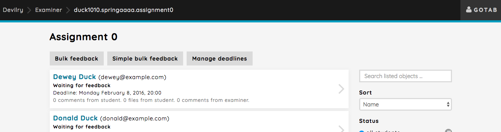
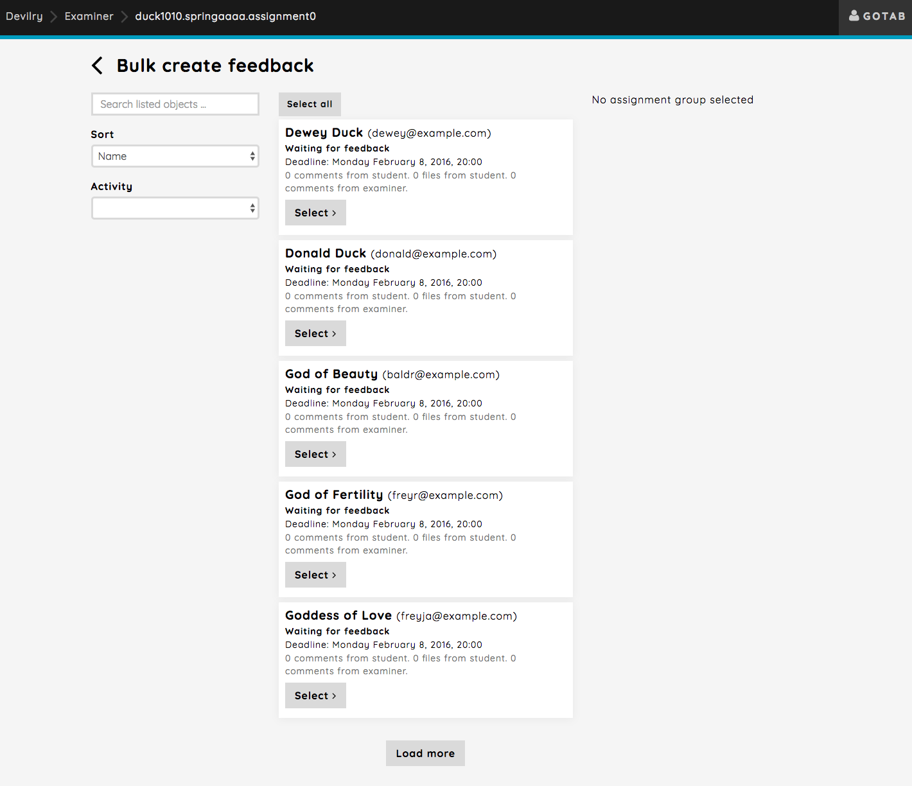
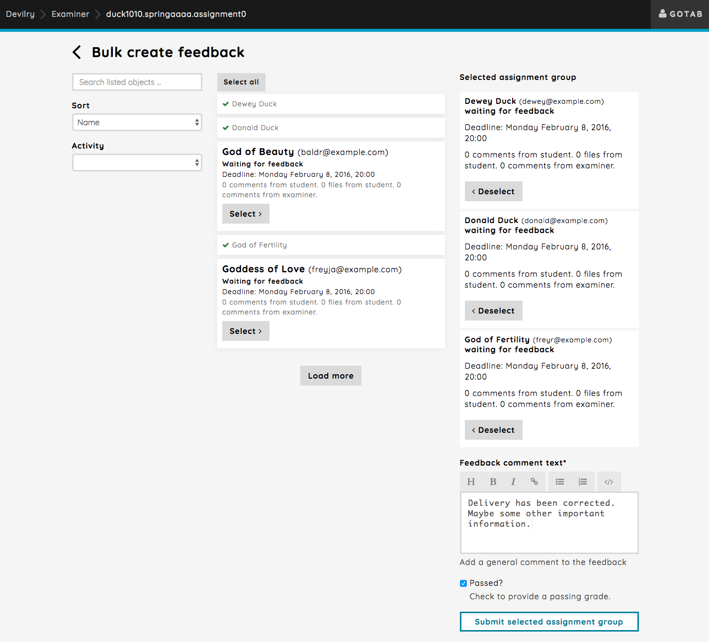
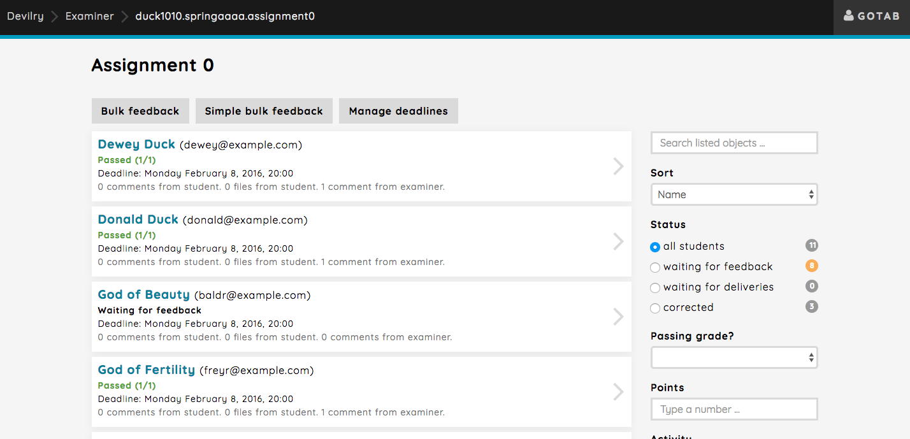
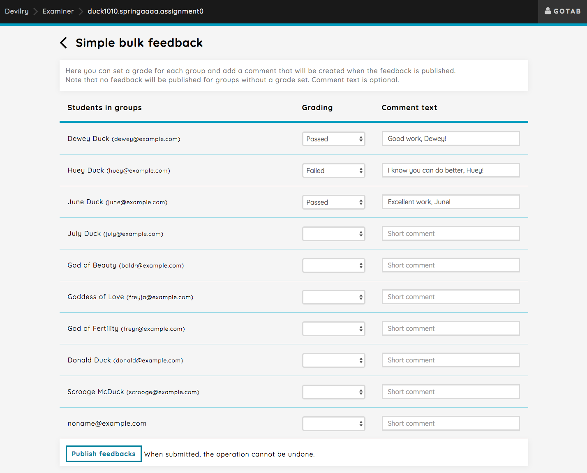
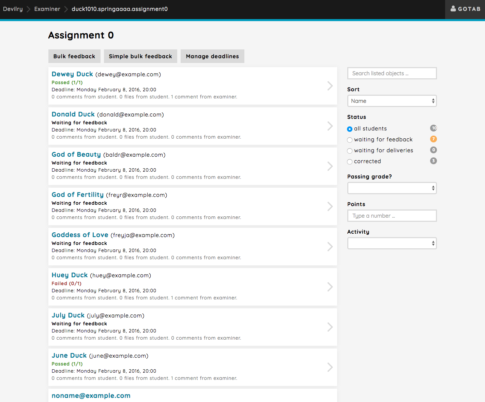

.. _examiner_bulk_feedback:

=========================
Bulk operations: Feedback
=========================
In some cases, a completely unique feedback for each group on the assignment won't be necessary. That's why Devilry
provide you with option to correct groups in bulk. We have two different ways of bulk correcting, `Bulk feedback` and
`Simple bulk feedback`.

Bulk feedback:
    Select the students you would like to correct. Give a grade and write a feedback.

Simple bulk feedback:
    Simple as is in simple feedback (no advanced text editor). You get a list of all groups, which you can give a
    grading to and a short textual feedback.

.. _examiner_bulk_feedback_regular:

Regular bulk feedback
=====================
The regular form of bulk feedback will give you the option of selecting a set of groups you want to provide feedback
for. Here you'll provide the same feedback for all selected groups, and you'll have an advanced text editor at your
disposal.

Select the students you would like to provide a feedback for. Let's select three students, set their grading to passed
and write a general comment as part of the feedback. The comment you write will appear in each groups delivery feed.

The students you selected and corrected will now show up in the assignment overview as passed.

.. _examiner_bulk_feedback_simple:

Simple bulk feedback
====================
The simple bulk feedback gives you the possibility to give different grades and short feedback texts for each groups on
the assignment. Let's correct three groups with various grading and comment texts. Only groups with the grade set will
be corrected. The comment text is optional.

The students you added a grade for will show up in the assignment overview with their grading.

