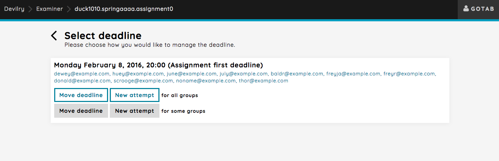
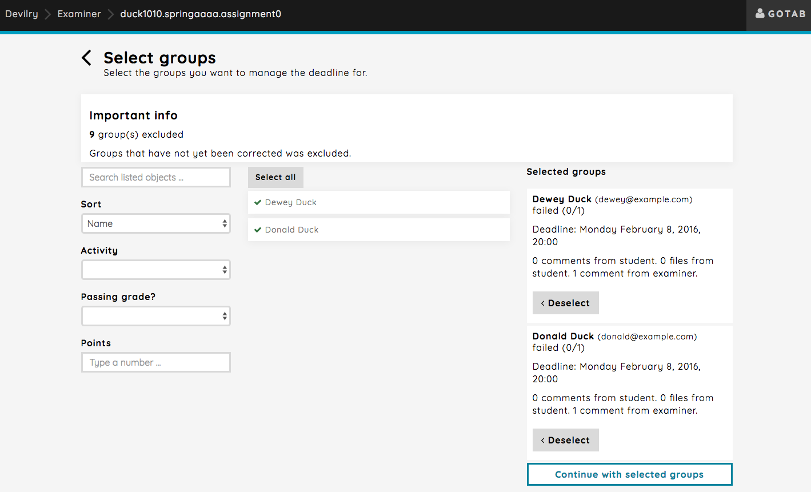

.. _examiner_bulk_manage_deadlines:

=================================
Bulk operations: Manage deadlines
=================================
It should be easy to move deadlines for multiple groups at once, or giving new attempts. Managing deadlines will give
an overview of all distinct deadlines within an assignment. You will different options regarding how you want to perform
a bulk operation. There are two different operations, move deadline and give new attempt. You can also, for each of
these operations, choose which students to include: some of them, or all of them.

Metadata about the deadline:
    As you can see, there's only one deadline for the assignment. This is the deadline that was set when the assignment was
    created. Each deadline will contain the list of groups that has this exact deadline. Each group is a link to their
    delivery feed.

Available operations:
    There's two sets of operations: ``Move deadline`` and ``New attempt``. Each of these operations can be performed for
    all groups, or a selected set of groups.

.. note::
    Moving the deadline for all groups when some groups are already corrected will simply exclude the corrected groups.
    A message will appear at the top of the page notifying you about this when selecting a operation for all groups.

.. note::
    Giving a new attempt for all groups when some groups are not yet corrected will simply exclude the uncorrected
    groups.
    A message will appear at the top of the page notifying you about this when selecting a operation for all groups.

.. _examiner_bulk_manage_deadlines_new_attempt:

New attempt
===========
For the sake of simplicity, say that the course you are an examiner on has a policy that states that all students are
to be given a second attempt should they fail their delivery. Simply give all or some failed groups a second attempt.

Let's use the manual select view for giving new attempts. Click the grey `New attempt` button. This will take you to a
page where you can select each group manually.

.. image:: images/examiner-bulk-manage-deadlines-new-attempt-select.png

As you can see at the top, all groups that have not yet been corrected are excluded. Which makes only corrected groups
available for selection. Hit the `select` button on both groups and press the `Continue with selected groups` button.

This will take you to the page where set the deadline for the new attempt and comment that will added to the delivery
feed.

.. image:: images/examiner-bulk-manage-deadlines-new-attempt-post-view.png

Clicking the `GIVE NEW ATTEMPT` button give all selected groups a new attempt, and the comment will be added to their
delivery feed.

.. _examiner_bulk_manage_deadlines_move_deadline:

Moving the deadline
===================

So, the deadline you set for the groups that where given a second attempt was a bit short. No problem, just move the
deadline for those groups.