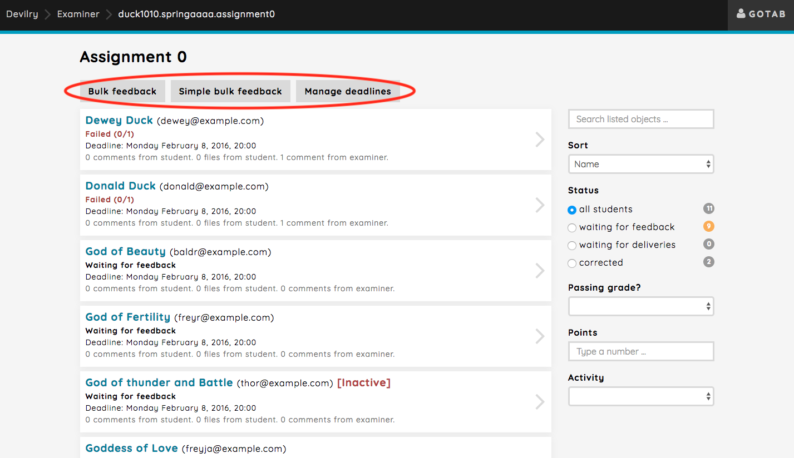

.. _examiner_bulk_operations:

===============
Bulk operations
===============

Available bulk operations
=========================

.. toctree::
   :maxdepth: 1

   examiner_bulk_manage_deadlines
   examiner_bulk_feedback

In Devilry, we want to enhance the workflow by providing some tools you can use to be more effective. In some cases
certain operations applies to more than just one group and would be tiresome to have to do for each group individually,
such as moving the deadline, giving new attempts or providing feedback.

As mentioned above, we provide a some bulk operations you can perform as an examiner:

Manage deadlines:
    Clicking the `Manage deadlines` button will take you to the page for managing deadlines where you can
    move deadlines for multiple groups or give new attempts.
    Read more about that here: :ref:`examiner_bulk_manage_deadlines` .

Bulk feedback:
    We provide a way for the examiner to correct multiple groups at once, and there's two ways of doing this: simple
    and advanced. Click the `Bulk feedback` or `Simple bulk feedback` based on what you want to do.
    Read more about that here: :ref:`examiner_bulk_feedback` .

