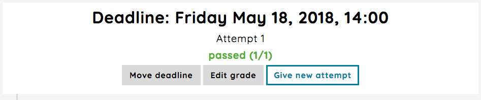
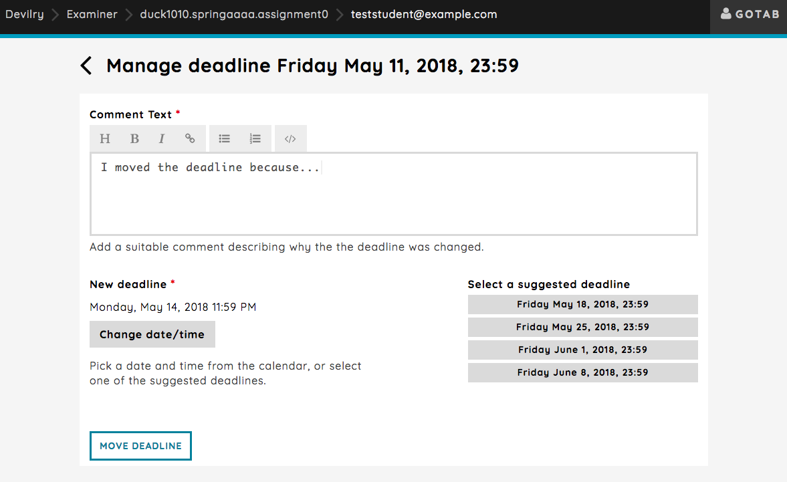
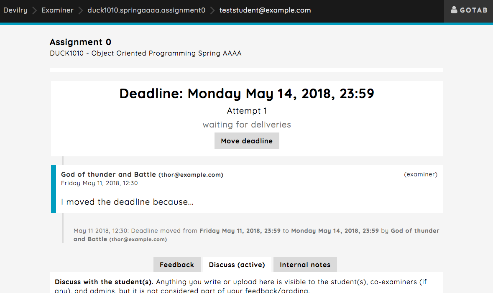
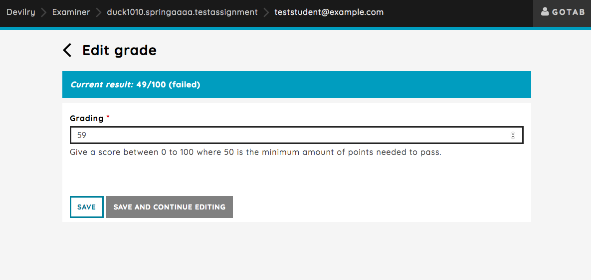
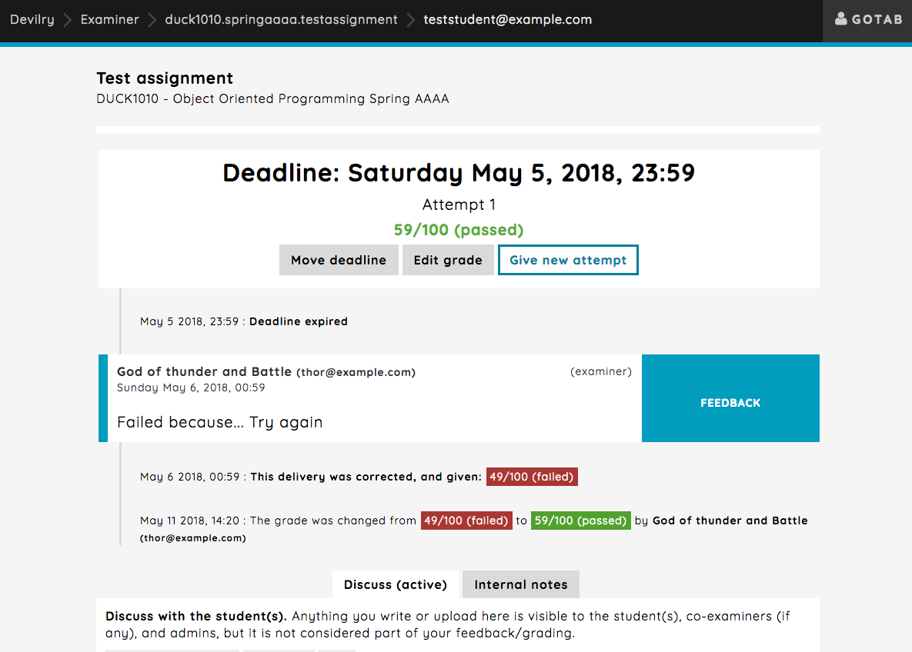
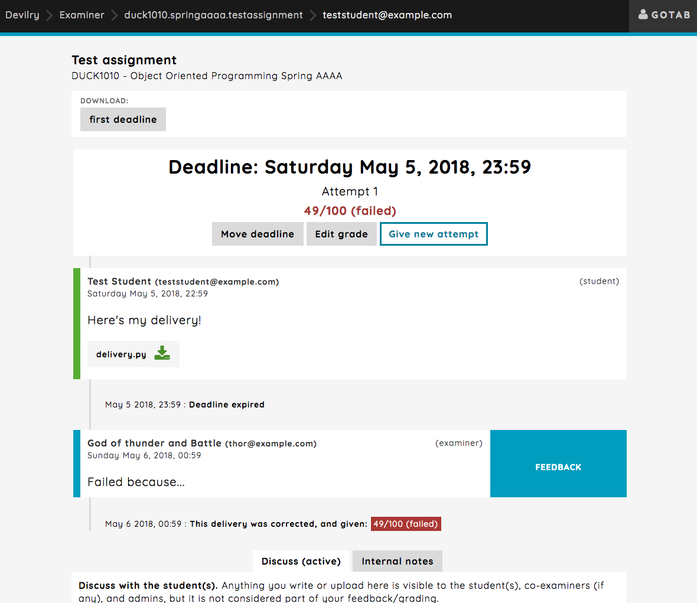
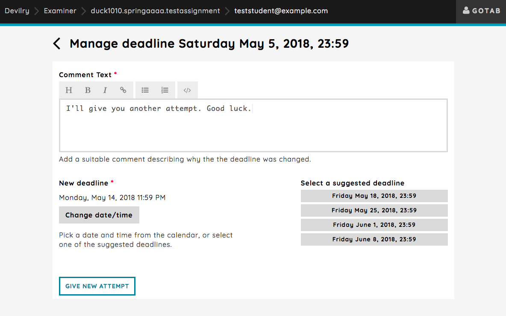
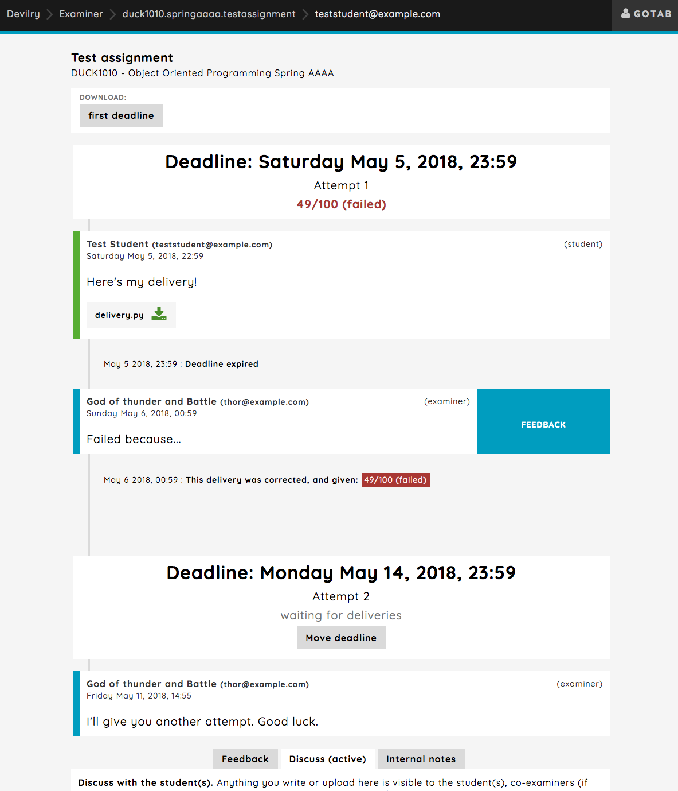

.. _examiner_delivery_feed_actions:

=====================
Delivery feed actions
=====================
When working in the delivery feed, you will have some options available such as moving the deadline, editing the
giving grade and giving a new attempt.

Move deadline
    You can move the deadline for this group. This will just move the deadline regardless of whether the
    assignment has been corrected or not, and will not influence the grading. A logged message will appear in
    feed when moving the deadline. See :ref:`devilry3_examiner_delivery_feed_move_deadline`.

Edit grade
    You can edit the given grade. You always edit the given grade for the current deadline, and a logged message will
    appear in the feed when doing so. See :ref:`devilry3_examiner_delivery_feed_edit_grade`.

Give new attempt
    Give student/students a new attempt that has to be corrected. See :ref:`devilry3_examiner_delivery_feed_new_attempt`.

.. _examiner_delivery_feed_move_deadline:

Moving the deadline
===================
The reason for moving a deadline for single group will usually be because the student asked for it and had a
valid reason.

Clicking the `Move deadline` button will take you to a page where you can set a deadline and provide a
reason for why the deadline was moved.

As you can see, a comment is required and you can choose from autogenerated deadlines, or add one your self by
using the `Change date/time` picker.

Here's an example of the feed after the deadline was moved, notice the logged message that appeared in the
feed. You can move the deadline back and forth as you please, if you need to adjust, but note that every change will
be logged and is visible to everyone:

.. _examiner_delivery_feed_edit_grade:

Editing the given grade
=======================
Say the assignment is points based, and the assignment text specifies how many points you get for each task. You correct
the assignment, but type in the wrong amount of points. You can easily correct the mistake by editing the grade by
clicking the `Edit grade` button, which will take you to a page where you edit the current grading.

Here's an example of the feed after the grade has been edited. Note that every change to the grade will
be logged and is visible to everyone:

.. _examiner_delivery_feed_new_attempt:

Giving a new attempt
====================
You have corrected the first delivery, and failed it. You're feeling good to day, so you decide to give the
student/students a second attempt at correcting their mistakes from the first delivery. As mentioned above, you can
edit an existing grade, but if the students actually failed, the correct way would be to give them another attempt.

Clicking the `Give new attempt` button will take you to a view where you can give the students another attempt.

Here's an example of the feed after a new attempt has been given:

