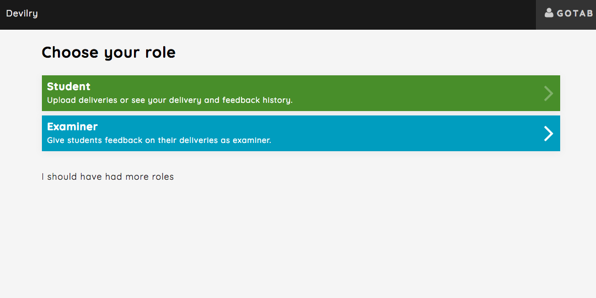
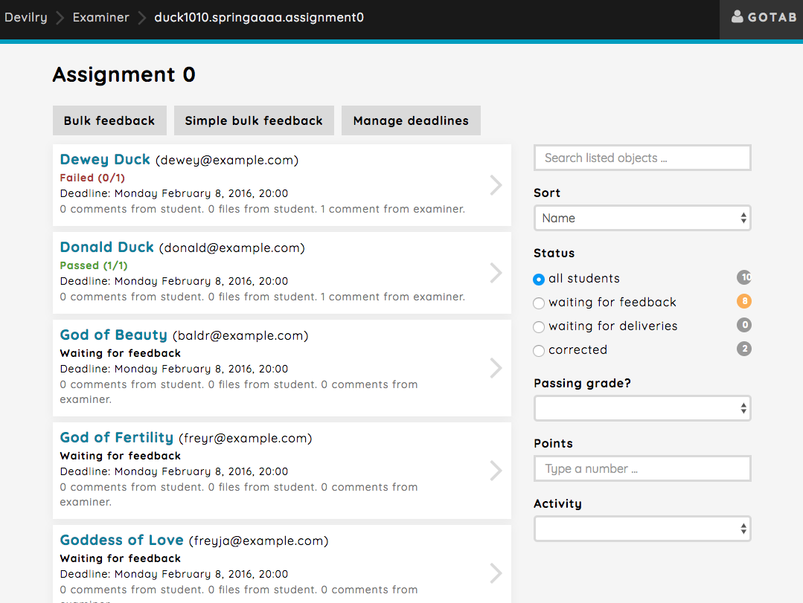
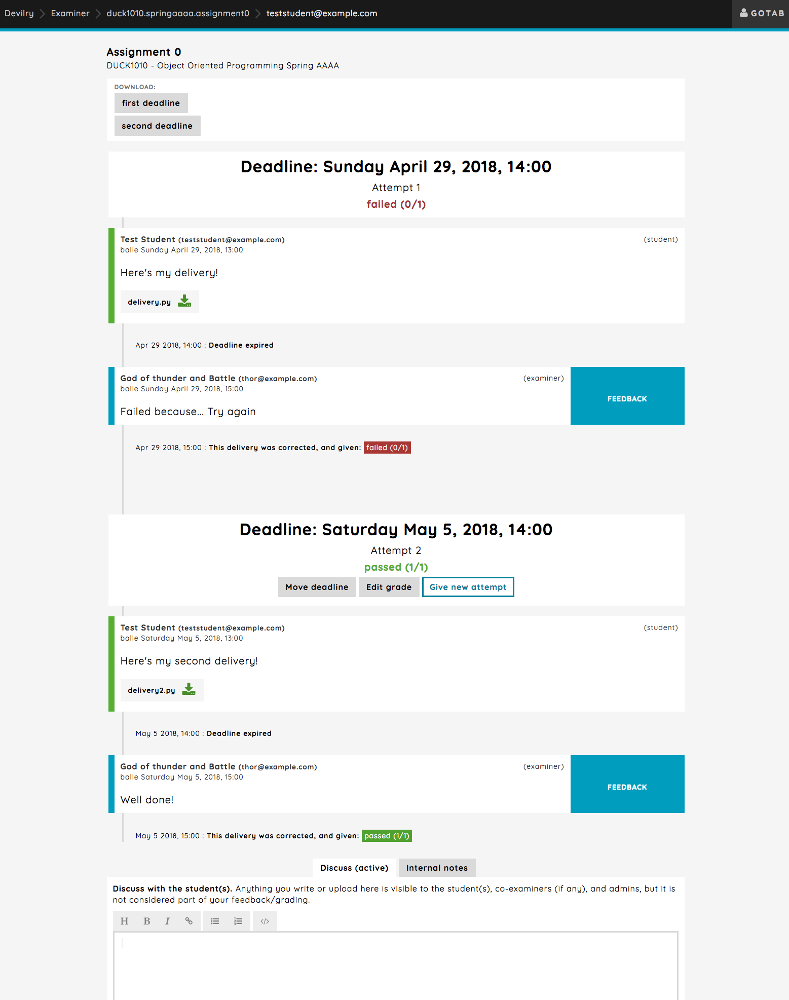

===================================
Getting started guide for examiners
===================================

.. note::

    To avoid confusion when reading this guide, please read
    :ref:`user_commonconcepts`, at least the :ref:`user_group_candidate_student` section.

.. note::

    This guide is under construction. Please contact devilry-support@ifi.uio.no
    if you have questions of any kind related to Devilry.

.. _examiner_role_overview:

Choose the examiner role
------------------------
After successful login you need to choose *Examiner* from the list of
available roles.

.. _examiner_assignment_overview:

Select an assignment
--------------------
After selecting the examiner, you will be taken to the assignment overview. All assignments with groups you are an
examiner on will be listed here, across subjects.

.. image:: images/examiner-assignment-overview.png

You can easily search for the assignment you are looking for, or order them by:
 - Deadlines (ascending/descending)
 - Assignment publishing time (ascending/descending)
 - Assignment names (ascending/descending)

.. _examiner_group_overview:

Select the group to correct
===========================
When selecting an assignment (see :ref:`examiner_assignment_overview`) you are redirected to a view
that lists all assignment groups where you are an examiner.

This list may be searched in or filtered to show a more fined tuned selection:

Search field
    You can search for both full names and usernames of the students.

all students
    Shows all the assignment groups where you are assigned as an examiner.
    This is the default filter upon entering the view.

waiting for feedback
    Shows assignment groups where the deadline has expired and the last
    delivery attempt is not corrected.

waiting for deliveries
    Shows assignment groups where the deadline has not yet expired.

corrected
    Show assignment groups that are corrected. Be aware that *corrected* will list
    both failed and passed students as long as they are corrected.

Passing grade?
    blank: Shows all, without or without grading.
    Yes: Only show students that have been corrected and passed.
    No: Show everyone except those that have been corrected and passed.

Points
    Show all the assignment groups with given amount of points.

Activity
    Show all assignment groups based on a certain activity, such as comments and files from students, examiners and
    comments from admins. Can also filter by missing comments and files.

The delivery feed
=================
When selecting an assignment group to correct (see :ref:`examiner_group_overview`) you will be
taken to the delivery feed. This is where students deliver their assignments, and this is where communication between
students, examiner and admins is happening.

As an examiner this is also where you correct deliveries from students, and some extra features will also be
available such as moving a deadline or giving the student/students new attempts. All happens through the feed, but, we
also provide the option to correct deliveries in bulk seen above the groups in the
:ref:`examiner_group_overview` section, which we'll discuss **here MISSING LINK TO BULK CORRECT GUIDE**

Here's a quick example of how the feed will look after a students has delivered an assignment, an examiner
failed the delivery and gave a new attempt, which the examiner corrected again and passed:

This is just a short introduction to the delivery feed, and we'll go more into detail in
:ref:`examiner_delivery_feed`.

