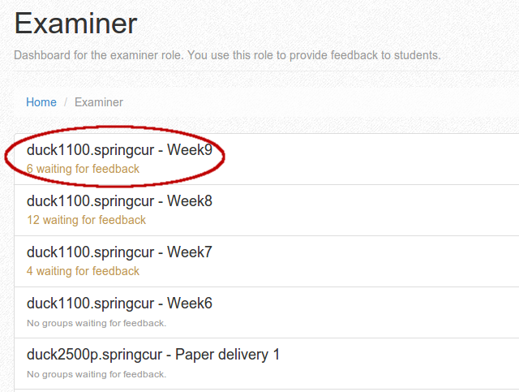

===================================
Getting started guide for examiners
===================================

.. note::

    To avoid confusion when reading this guide, please read
    :ref:`commonconcepts`, at least the :ref:`group_candidate_student` section.

.. note::

    This guide is under construction. Please contact devilry-support@ifi.uio.no
    if you have questions of any kind related to Devilry.

Choose the examiner role
------------------------
After successful login you need to choose *Examiner* from the list of
available roles.

Select an assignment
--------------------

    
On the examiner *dashboard*, assignments where you are examiners are listed.
To start correcting, you must choose the spesific assignment in which you want
to work with. The list are ordered by the time the assignments where published in 
descending order. This ensure that your latest assignment are listed on top.

.. _allgroupsoverview:

Select the group to correct
---------------------------

.. image:: images/examiner/v2-allgroupsoverview.png

After the assignment is choosen you are redirected to a view that list all groups
on the assignment. 

The list may be filtered to show a more fine grained selection:

Waiting for feedback
    Shows the assignment groups that have at least one valid delivery
    and are waiting for feedback to be provided by the examiner.

Waiting for deliveries
    Shows the assignment groups that have **not** provided a valid delivery yet.

Corrected
    Shows the assignment groups that are corrected. Be aware that *Corrected* will list
    both failed and passed groups as long as they are corrected.

All
    Shows every assignment group on the assignment where yourself are the assigned examiner.
    This is the default filter upon entering the view.

To start correcting you would normally filter with the *Waiting for feedback* option. The **Write feedback**
button on the group item in the list will take you directly to the latest delivery provided by the group.
see :ref:`deliveryview` for further details.

If you need access to older deliveries provided by the group you must click on the group name header in the list 
item which redirect you a detailed view for that assignment. More information on this view in :ref:`singlegroupoverview`

.. _deliveryview:

Add feedback to the delivery
----------------------------
Upon entering the delivery you will need to click the *Provide feedback* button
to start giving feedback. 

Provide Feedback
^^^^^^^^^^^^^^^^
This view may vary depending on the grading system configured for the assignment.
The picture show a simple points system with a form to provide the number points achieved.

Every grading system features the ability to provide a feedback text in addition to the grade information.
Click inside the textbox and a ``WYSIWYG Markdown`` editor will be shown. Just type in the feedback and push the *Publish*
button to publish the feedback without examine a preview. If you lack experience with ``Markdown`` you would probably want to
click the *Preview* button to be able to secure that the feedback appear as supposed.

Feedback drafts and history
^^^^^^^^^^^^^^^^^^^^^^^^^^^
You may save you work for later by clicking the *Save Draft* button

Correct the next delivery
-------------------------
When there is multiple groups *Waiting for feedback* you can loop through each group
by clicking the arrow button in the upper right corner of the view.

.. _singlegroupoverview:

Correct an earlier delivery
---------------------------
When choosing the spesific group every delivery attempts will be listed categorised by the their respective deadlines.
This makes it possible to correct a delivery that is not the latest one. 
