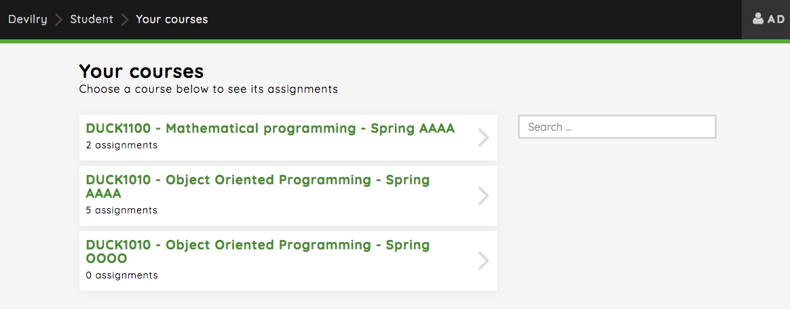
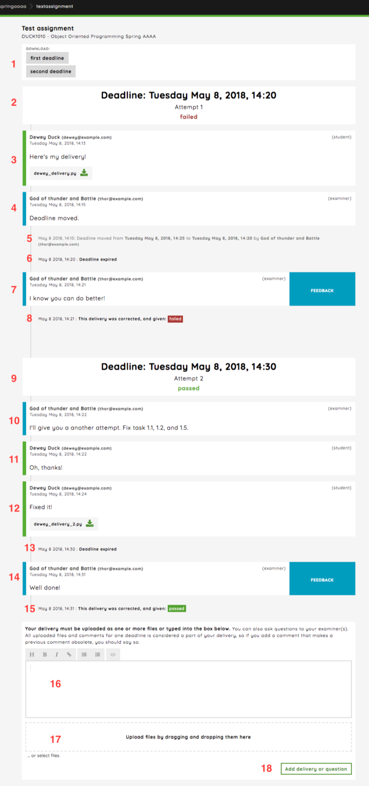

###########################
Student dashboards overview
###########################

Let's look at how the student will go around finding the courses they have access to,
assignments and the delivery feed.

Role select overview
====================
When a student logs into Devilry, they will greeted by the roleselect view. A user might have multiple roles such as
student, examiner and/or admin. These will be displayed here, and the user selects the desired role.

.. image:: images/student-roleselect-overview.png

Selecting the student role will take the user to the :ref:`student_assignments_overview`.

.. _student_assignments_overview:

Assignment overview
===================
The student will see a list of all the assignments they currently have access to across courses.

.. image:: images/student-assignment-overview.png

Here the student will be able to search the assignments by the name of the assignment, course or semester, giving the
student a shortcut to finding their assignment effectively. Optionally the student can also head to the
:ref:`student_courses_overview` to select a specific course clicking the button labeled ``Your courses``.

Clicking on an assignment will the the user to the :ref:`student_delivery_feed`.

.. _student_courses_overview:

Courses overview
================
The student will see a list over the courses they currently have access to. For each course, the number of assignments
are displayed.

Here the student will be able to search for courses by course or semester. Clicking on a course will take the student
to a overview over assignments for that specific course (see :ref:`student_assignments_overview`).

.. _student_delivery_feed:

Assignment delivery feed
========================
Clicking on an assignment from the :ref:`student_assignments_overview` will take the student to the delivery
feed for that assignment.

The delivery feed is where students delivers assignments and communicates with other students in their group,
examiners and admins.

Here's an overview of common elements in the delivery feed, containing deliveries, correcting the delivery, expired
and moved deadlines, new attempt etc.

**1. Compressed archives**: Uploaded files for each attempt(deadline). Clicking the button will start a background task compressing the contents making a compressed archive available.

**2. First attempt overview**: An overview of the first deadline and the result.

**3. Comment**: Student delivery with file attached.

**4. Comment**: Examiner comment about moving the deadline.

**5. Event**: Examiner moved the deadline.

**6. Event**: Deadline expired.

**7. Comment (grading)**: Examiner provides textual feedback.

**8. Event (grading)**: An event showing the given grade failed.

**9. Second attempt overview**: An overview of the second deadline and the result(this differ based on whether the deadline has expired, the delivery is corrected etc).

**10. Comment**: Examiner writes to the student.

**11. Comment**: Student answers.

**12. Comment**: Student delivery with file attached.

**13. Event**: Deadline expired.

**14. Comment (grading)**: Examiner provides textual feedback.

**15. Event (grading)**: An event showing the given grade passed.

**16. Input field**: Markdown supported input field

**17. File upload section**: Drag-and-drop file/files.

**18. Submit button**: Submit the comment.
