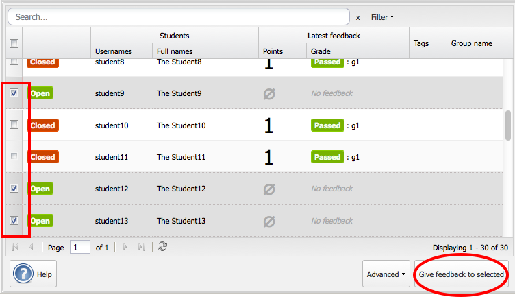

===========================================================
How to examine in bulk or correct non electronic deliveries
===========================================================

.. note::

    To avoid total confusion when reading this guide, please read
    :ref:`commonconcepts`, at least the :ref:`group_candidate_student`-section.

Introduction
############
This is a guide for examiners who want to give the same feedback to multiple
groups at once and for examiners giving feedback to assignments
where Devilry is only used to register results(not for deliveries).

Choose the examiner role
########################
It should be one of the available roles on your frontpage.

Select an assignment
####################

.. image:: images/examiner/dash-select-assignment.png

On the examiner *dashboard*, assignments where you are examiners are listed
ordered by publishing time in descending order. Choose an assignment from this
list to get start giving feedback on that assignment.

Group overview
##############

When you enter the examiner interfance, you will see an overview of all groups on
that assignment. Choose one or more groups and click *Give feedback to
selected*. A window containing the *grade editor* is shown. Click the
Help-button in the lower left corner of the *grade editor* for more help.

.. note::

    You can right-click anywhere in the group overview for quick access to
    everything in the toolbar.
